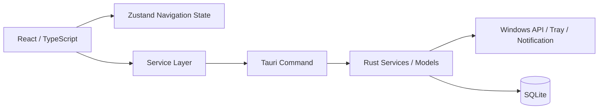

# Time Is Money Project Spec

## 1. アプリ概要

- 仮のアプリ名: Time Is Money
- アプリの目的: PC 作業中に使った時間を金額換算し、浪費の傾向を可視化する。
- 解決したい課題: 何にどれだけ時間を使ったかを感覚ではなく数値で把握しにくいこと。
- 想定ユーザー: Windows PC で仕事や学習をしている個人ユーザー。
- 将来的な完成イメージ: 前面アプリやサイトの利用時間を自動で集計し、金額・カテゴリ・通知・履歴で確認できるデスクトップアプリ。
- 現在実装済みの範囲: 4画面とナビゲーション、アプリ起動からの経過時間表示、自動起動設定、テスト通知、起動1分後の仮通知、システムトレイ、前面ウィンドウ情報の単発取得、Tauri Command、型・値検証付きフロントサービス。
- 現在未実装の範囲: 前面ウィンドウの継続監視、アプリ別利用時間の計測、ウィンドウ切り替え検知、SQLiteへの保存、分類ルールの作成・適用、活動履歴表示、実際の利用条件に基づく通知、集計、グラフ、ブラウザ拡張機能、外部通信。

## 2. 使用技術

### Tauri v2

- 何か: Rust バックエンドと Web フロントエンドを組み合わせるデスクトップアプリ基盤。
- 一般的な用途: 軽量なクロスプラットフォームデスクトップアプリの開発。
- このアプリでの担当: Windows向けデスクトップウィンドウ、Tauri Command、通知・自動起動プラグイン、システムトレイなどOS連携の窓口。
- 採用理由: Electron より軽量な構成を保ちやすく、Rust 側に OS 依存処理を寄せやすい。
- 現時点の導入状況: 導入済み。
- 導入する予定の段階: 基盤として初期段階から利用する。

### React

- 何か: UI をコンポーネント単位で組み立てるライブラリ。
- 一般的な用途: SPA やデスクトップ UI の画面構築。
- このアプリでの担当: Dashboard / History / Rules / Settings の画面表示。
- 採用理由: 画面分割と将来的な拡張がしやすい。
- 現時点の導入状況: 導入済み。
- 導入する予定の段階: 画面雛形の段階から利用する。

### TypeScript

- 何か: JavaScript に型を追加した言語。
- 一般的な用途: フロントエンドの型安全な開発。
- このアプリでの担当: 画面、型定義、状態管理、Tauri Commandを呼ぶサービス境界の整理。
- 採用理由: 将来のデータ構造や Tauri Command の呼び出しを整理しやすい。
- 現時点の導入状況: 導入済み。
- 導入する予定の段階: 最初から利用する。

### Vite

- 何か: 高速なフロントエンド開発・ビルドツール。
- 一般的な用途: 開発サーバー、HMR、成果物ビルド。
- このアプリでの担当: React フロントエンドの起動とビルド。
- 採用理由: Tauri のフロントエンドと相性がよく、開発体験が軽い。
- 現時点の導入状況: 導入済み。
- 導入する予定の段階: 初期構成から利用する。

### Rust

- 何か: 高性能で安全性を重視したシステムプログラミング言語。
- 一般的な用途: OS 連携、CLI、バックエンド、ネイティブアプリ基盤。
- このアプリでの担当: Tauriバックエンド、Windows APIによる単発取得、通知・トレイ・ウィンドウ制御、将来的なデータ処理。
- 採用理由: Windows API やファイル/SQLite 周りを堅牢に扱いやすい。
- 現時点の導入状況: 導入済み。
- 導入する予定の段階: 最初から利用する。

### SQLite

- 何か: 埋め込み型の軽量データベース。
- 一般的な用途: ローカル保存、設定管理、履歴管理。
- このアプリでの担当: 活動履歴、ルール、設定の端末内保存。
- 採用理由: 外部サーバーを使わずにデータを端末内へ保存できる。
- 現時点の導入状況: 未導入。
- 導入する予定の段階: 履歴保存の実装段階。

### Zustand

- 何か: React 向けの軽量状態管理ライブラリ。
- 一般的な用途: UI 状態やローカル状態の管理。
- このアプリでの担当: 画面切り替えと、アプリ起動からの経過時間を表すUI状態。
- 採用理由: 大げさな状態管理を避けつつ、必要な共有状態を持てる。
- 現時点の導入状況: 導入済み。
- 導入する予定の段階: 初期画面から利用する。

### Zod

- 何か: 実行時バリデーションと型推論を両立しやすいスキーマライブラリ。
- 一般的な用途: フォーム入力や設定値の検証。
- このアプリでの担当: 型に対応するスキーマと、Tauri Commandから返る前面ウィンドウ情報の実行時検証。
- 採用理由: TypeScript 型と実行時検証を近い形で保てる。
- 現時点の導入状況: 導入済み。
- 導入する予定の段階: 雛形の段階からスキーマを準備する。

### Tauri SQL Plugin

- 何か: Tauri から SQL ベースの保存処理を扱うためのプラグイン。
- 一般的な用途: ローカル DB へのアクセス。
- このアプリでの担当: 将来的な SQLite への保存と参照。
- 採用理由: Rust 側で直接 SQL 取り回しを抱えすぎず、Tauri 側の仕組みに寄せられる可能性があるため。
- 現時点の導入状況: 未導入。
- 導入する予定の段階: SQLite 永続化を実装する段階。

### Tauri Store Plugin

- 何か: Tauri でローカルな小規模設定を扱うためのプラグイン。
- 一般的な用途: 軽量な設定保存。
- このアプリでの担当: 将来的なアプリ設定の補助的保存。
- 採用理由: すべてを SQLite に寄せる前の選択肢として検討できる。
- 現時点の導入状況: 未導入。
- 導入する予定の段階: 保存方式を確定した後に判断する。

### Tauri Notification Plugin

- 何か: ネイティブ通知を出すためのプラグイン。
- 一般的な用途: デスクトップ通知。
- このアプリでの担当: Settingsからのテスト通知と、Rust側からの起動1分後の開発用仮通知。将来は実際の利用時間に基づく注意喚起を担当する。
- 採用理由: Windows 標準の通知体験に合わせやすい。
- 現時点の導入状況: Rust・TypeScriptの両側へ導入済み。通知権限の確認、テスト送信、起動1分後の仮通知まで実装済み。
- 導入する予定の段階: プラグイン導入は完了。利用時間や設定値との接続は後続段階で行う。

### Tauri Autostart Plugin

- 何か: OS 起動時の自動起動を扱うプラグイン。
- 一般的な用途: ログイン後の自動起動。
- このアプリでの担当: Windows 起動時にアプリを立ち上げる設定。
- 採用理由: 常駐系の利用と相性がよい。
- 現時点の導入状況: 導入済み。Settingsから現在状態を確認し、有効・無効を切り替えられる。
- 導入する予定の段階: 基本実装は完了。必要に応じて初期値やエラー表示を調整する。

### Tauri TrayIcon

- 何か: システムトレイにアイコンを出す仕組み。
- 一般的な用途: バックグラウンド常駐アプリの操作口。
- このアプリでの担当: ウィンドウを閉じたときの非表示化、左クリックでの再表示、メニューからの再表示・終了。
- 採用理由: 監視系アプリの操作性を損なわずに常駐しやすい。
- 現時点の導入状況: 導入済み。アプリアイコン、開く・終了メニュー、左クリックによる再表示を実装済み。
- 導入する予定の段階: 基本実装は完了。継続監視処理はまだ接続していない。

### Windows API

- 何か: Windows 固有の OS 機能を扱う API 群。
- 一般的な用途: 前面ウィンドウ取得、アイドル判定、自動起動、ウィンドウ管理。
- このアプリでの担当: 前面ウィンドウの実行ファイル名、タイトル、PIDの単発取得。アイドル判定は将来の対象。
- 採用理由: Windows 向けアプリとして必要な情報を直接取得しやすい。
- 現時点の導入状況: 前面ウィンドウ情報の単発取得へ導入済み。
- 導入する予定の段階: 単発取得は実装済み。継続監視やアイドル判定は後続段階で追加する。

### Rust の windows クレート

- 何か: Windows API を Rust から扱うためのクレート。
- 一般的な用途: Win32 API や COM を Rust で呼ぶ。
- このアプリでの担当: 前面ウィンドウ取得、プロセス情報、アイドル判定などの Windows 依存処理。
- 採用理由: Rust の型安全さを保ちながら Windows API を扱いやすい。
- 現時点の導入状況: 必要なWin32 featureに限定したWindowsターゲット依存として導入済み。
- 導入する予定の段階: 前面ウィンドウの単発取得へ導入済み。追加APIは用途が決まった段階で検討する。

## 3. アーキテクチャ

- React・TypeScript 側が担当する処理: 画面表示、ナビゲーション、アプリ起動からの経過時間状態、自動起動設定、テスト通知、サービス層を通したCommand呼び出しと実行時検証。
- Rust 側が担当する処理: Tauriウィンドウ制御、Windows APIによる前面ウィンドウ情報の単発取得、Tauri Command、システムトレイ、起動1分後の仮通知、将来的な保存処理の仲介。
- Tauri Command の呼び出し構造: `getActiveWindowInfo()` が `@tauri-apps/api` の `invoke("get_active_window_info")` を呼び、戻り値をZodで検証する。Dashboardからはまだ呼び出していない。
- Native Messaging の固定仕様: Chrome拡張機能とNative Messaging Host間の入出力契約は `docs/NATIVE_MESSAGING_PROTOCOL.md` を正本とする。
- 将来的な SQLite 保存の流れ: UI で設定や分類結果を更新し、Rust 側のサービスが SQLite へ保存する予定。
- 前面ウィンドウ取得の流れ: Rust側のplatformモジュールがWindows APIから情報を取得し、登録済みCommand経由でフロントサービスへ返す。
- 現在のタイマー表示の流れ: `App.tsx` が起動時刻をZustandへ保存し、1秒ごとに実経過時間を同期してDashboardへ表示する。この値はアプリ別の利用時間ではない。
- 将来的な活動計測の流れ: 前面ウィンドウを継続監視し、切り替わりで活動時間を区切って活動レコードとして保存する予定。
- 将来的な分類ルール適用の流れ: `AppRule` に基づいて process/title/domain を分類し、カテゴリを決定する予定。
- 現在の通知処理: Settingsから権限確認後にテスト通知を送れる。Rust側には起動1分後の仮通知があり、将来は実際の活動時間と設定値を使う条件へ置き換える。

### 構成図



## 4. ファイル構成

### `src/`

- 何か: React フロントエンドの本体。
- 何のために存在するか: 画面表示、状態管理、将来の設定やデータ取得の分離。
- 将来的にどの処理を担当するか: UI、ユーザー操作、Command 呼び出しの起点。
- 現時点でどこまで実装されているか: 4画面の切り替え、起動経過タイマー、自動起動設定、テスト通知を実装済み。HistoryとRulesはプレースホルダー。
- どのファイルから呼ばれる予定か: `index.html` から `src/main.tsx` を経由して起動される。
- 今後どのような機能を追加する場所か: グラフ、入力フォーム、履歴、設定 UI。

### `src/components/layout/`

- 何か: 画面共通のレイアウトを置く場所。
- 何のために存在するか: 画面ごとの共通構造を分離するため。
- 将来的にどの処理を担当するか: サイドバー、ヘッダー、レイアウト枠。
- 現時点でどこまで実装されているか: `AppLayout` と `Sidebar` のみ。
- どのファイルから呼ばれる予定か: `src/App.tsx` から呼ばれる。
- 今後どのような機能を追加する場所か: ナビゲーション拡張、常駐操作、レイアウト共通化。

### `src/pages/`

- 何か: 画面単位の React コンポーネントを置く場所。
- 何のために存在するか: Dashboard / History / Rules / Settings を独立させるため。
- 将来的にどの処理を担当するか: 各画面のデータ表示、入力、状態表示。
- 現時点でどこまで実装されているか: Dashboardは起動経過時間を表示し、Settingsは自動起動とテスト通知を操作できる。HistoryとRulesはページ名と説明のみ。
- どのファイルから呼ばれる予定か: `src/App.tsx` から呼ばれる。
- 今後どのような機能を追加する場所か: 集計グラフ、一覧、編集フォーム。

### `src/stores/useNavigationStore.ts`

- 何か: 画面切り替え用の Zustand ストア。
- 何のために存在するか: ナビゲーション状態を分離するため。
- 将来的にどの処理を担当するか: 画面遷移や UI 状態の共有。
- 現時点でどこまで実装されているか: `currentPage` と切り替えのみ。
- どのファイルから呼ばれる予定か: `src/hooks/useNavigation.ts` と `src/App.tsx` から呼ばれる。
- 今後どのような機能を追加する場所か: 選択中の期間、フィルタ、表示モード。

### `src/stores/useActivityStore.ts`

- 何か: アプリ起動からの経過時間を管理するZustandストア。
- 何のために存在するか: `setInterval`の呼び出し回数ではなく、開始時刻との差分から実経過時間を表示するため。
- 将来的にどの処理を担当するか: 現在は起動経過時間のみ。アプリ別活動計測とは分離したまま、必要に応じて表示状態を拡張する。
- 現時点でどこまで実装されているか: 開始時刻の記録、1秒単位の同期、負の経過時間を0へ補正する処理を実装済み。
- どのファイルから呼ばれるか: `src/App.tsx`が開始・同期し、`src/pages/DashboardPage.tsx`が表示する。
- 今後どのような機能を追加する場所か: アプリ全体の計測状態表示。前面アプリ別の履歴データは別の監視・保存層で管理する。

### `src/hooks/useNavigation.ts`

- 何か: Zustand ストアを扱いやすくする小さな hook。
- 何のために存在するか: UI 側からの利用を簡潔にするため。
- 将来的にどの処理を担当するか: 画面切り替え状態の参照と更新。
- 現時点でどこまで実装されているか: 現在ページと切り替え関数を返すだけ。
- どのファイルから呼ばれる予定か: `src/App.tsx` から呼ばれる。
- 今後どのような機能を追加する場所か: フィルタや選択状態をまとめる hook の追加。

### `src/constants/navigation.ts`

- 何か: ナビゲーション項目の定義。
- 何のために存在するか: sidebar と state の型をそろえるため。
- 将来的にどの処理を担当するか: 画面追加時のルーティング/切り替え定義。
- 現時点でどこまで実装されているか: 4 画面分の項目のみ。
- どのファイルから呼ばれる予定か: `Sidebar` と `useNavigationStore` から参照される。
- 今後どのような機能を追加する場所か: 画面追加時の項目増設。

### `src/services/`

- 何か: UI と Tauri Command の間に置くサービス層。
- 何のために存在するか: 画面から直接 Rust 実装を意識しないため。
- 将来的にどの処理を担当するか: Command呼び出し、データ検証・整形、保存ロジック。
- 現時点でどこまで実装されているか: `activityService.ts` に時間表示用の `formatTime()` と、前面ウィンドウ情報を1回取得してnullableなZodスキーマで型・値検証する `getActiveWindowInfo()` がある。
- どのファイルから呼ばれる予定か: 境界テストから利用済み。画面や監視hookからの呼び出しは未実装。
- 今後どのような機能を追加する場所か: activity / settings / tauri の処理拡張。

### `src/types/`

- 何か: 将来のデータ構造を表す型定義。
- 何のために存在するか: UI と Rust 側の設計を合わせるため。
- 将来的にどの処理を担当するか: 活動記録、設定、前面ウィンドウ情報の型管理。
- 現時点でどこまで実装されているか: 主要な型だけを先に定義している。
- どのファイルから呼ばれる予定か: サービス、ページ、Rust モデル設計の参照元。
- 今後どのような機能を追加する場所か: 履歴、設定、集計の型追加。

### `src/utils/schemas.ts`

- 何か: Zod スキーマを置く場所。
- 何のために存在するか: 型と実行時検証の雛形をそろえるため。
- 将来的にどの処理を担当するか: 設定値や Command 入力の検証。
- 現時点でどこまで実装されているか: 型に対応するスキーマに加え、`activeWindowInfoSchema` がプロセス名の空文字とu32範囲外・非整数・0のPIDを拒否し、Tauri Commandの戻り値検証に利用されている。
- どのファイルから呼ばれる予定か: `activityService.ts` から利用済み。将来的にフォームや保存処理からも呼ばれる。
- 今後どのような機能を追加する場所か: 入力検証と保存前チェック。

### `src-tauri/`

- 何か: Rust 側の Tauri バックエンド。
- 何のために存在するか: OS 依存処理と将来の Command をまとめるため。
- 将来的にどの処理を担当するか: 前面ウィンドウ取得、保存、通知、常駐、起動処理。
- 現時点でどこまで実装されているか: 前面ウィンドウ取得のplatform処理とTauri Command、通知、自動起動、システムトレイ、閉じる操作でのウィンドウ非表示化を実装済み。
- どのファイルから呼ばれる予定か: Tauri ランタイムから起動される。
- 今後どのような機能を追加する場所か: 継続監視、Command拡張、SQLite、利用条件に基づく通知。

### `src-tauri/src/models/`

- 何か: Rust の共有データモデル。
- 何のために存在するか: TS 型と意味を合わせるため。
- 将来的にどの処理を担当するか: Command 戻り値、保存データ、変換処理。
- 現時点でどこまで実装されているか: Activity / Settings 系の構造体のみ。
- どのファイルから呼ばれる予定か: `commands` と `services` から参照される。
- 今後どのような機能を追加する場所か: 履歴やルールの Rust 側モデル追加。

### `src-tauri/src/commands/`

- 何か: Tauri Command を置く層。
- 何のために存在するか: Rust 側の関数をフロントから呼びやすくするため。
- 将来的にどの処理を担当するか: 設定取得、履歴保存、状態読み出しなど。
- 現時点でどこまで実装されているか: `activity.rs` の `get_active_window_info` がplatform層の結果を安全なCommand結果へ変換する。
- どのファイルから呼ばれる予定か: `lib.rs` のinvoke handlerへ登録済みで、フロントサービスから呼ばれる。
- 今後どのような機能を追加する場所か: Activity / Settings / Tray / Window 系 Command。

### `src-tauri/src/platform/windows.rs`

- 何か: Windows 固有処理の配置場所。
- 何のために存在するか: OS 依存処理を Rust 側で分離するため。
- 将来的にどの処理を担当するか: 前面ウィンドウ取得、アイドル状態、プロセス情報。
- 現時点でどこまで実装されているか: 最小権限で前面ウィンドウの実行ファイル名、タイトル、PIDを単発取得する。前面ウィンドウなしと取得失敗を区別し、process handleをRAIIで解放する。
- どのファイルから呼ばれる予定か: `commands/activity.rs` から呼ばれている。
- 今後どのような機能を追加する場所か: 後続要件で必要になったWindows固有処理。継続監視自体はこの層では行わない。

### `src-tauri/migrations/`

- 何か: SQLite マイグレーション置き場。
- 何のために存在するか: スキーマ変更を履歴として管理するため。
- 将来的にどの処理を担当するか: DB テーブル作成や更新。
- 現時点でどこまで実装されているか: README のみで未実装。
### Tauri Autostart Plugin

- 何か: OS 起動時の自動起動を扱うプラグイン。
- 一般的な用途: ログイン後の自動起動。
- このアプリでの担当: Windows 起動時にアプリを立ち上げる設定。
- 採用理由: 常駐系の利用と相性がよい。
- 現時点の導入状況: 導入済み。Settingsから現在状態を確認し、有効・無効を切り替えられる。
- 導入する予定の段階: 基本実装は完了。必要に応じて初期値やエラー表示を調整する。

### Tauri TrayIcon

- 何か: システムトレイにアイコンを出す仕組み。
- 一般的な用途: バックグラウンド常駐アプリの操作口。
- このアプリでの担当: ウィンドウを閉じたときの非表示化、左クリックでの再表示、メニューからの再表示・終了。
- 採用理由: 監視系アプリの操作性を損なわずに常駐しやすい。
- 現時点の導入状況: 導入済み。アプリアイコン、開く・終了メニュー、左クリックによる再表示を実装済み。
- 導入する予定の段階: 基本実装は完了。継続監視処理はまだ接続していない。

### Windows API

- 何か: Windows 固有の OS 機能を扱う API 群。
- 一般的な用途: 前面ウィンドウ取得、アイドル判定、自動起動、ウィンドウ管理。
- このアプリでの担当: 前面ウィンドウの実行ファイル名、タイトル、PIDの単発取得。アイドル判定は将来の対象。
- 採用理由: Windows 向けアプリとして必要な情報を直接取得しやすい。
- 現時点の導入状況: 前面ウィンドウ情報の単発取得へ導入済み。
- 導入する予定の段階: 単発取得は実装済み。継続監視やアイドル判定は後続段階で追加する。

### Rust の windows クレート

- 何か: Windows API を Rust から扱うためのクレート。
- 一般的な用途: Win32 API や COM を Rust で呼ぶ。
- このアプリでの担当: 前面ウィンドウ取得、プロセス情報、アイドル判定などの Windows 依存処理。
- 採用理由: Rust の型安全さを保ちながら Windows API を扱いやすい。
- 現時点の導入状況: 必要なWin32 featureに限定したWindowsターゲット依存として導入済み。
- 導入する予定の段階: 前面ウィンドウの単発取得へ導入済み。追加APIは用途が決まった段階で検討する。

## 3. アーキテクチャ

- React・TypeScript 側が担当する処理: 画面表示、ナビゲーション、アプリ起動からの経過時間状態、自動起動設定、テスト通知、サービス層を通したCommand呼び出しと実行時検証。
- Rust 側が担当する処理: Tauriウィンドウ制御、Windows APIによる前面ウィンドウ情報の単発取得、Tauri Command、システムトレイ、起動1分後の仮通知、将来的な保存処理の仲介。
- Tauri Command の呼び出し構造: `getActiveWindowInfo()` が `@tauri-apps/api` の `invoke("get_active_window_info")` を呼び、戻り値をZodで検証する。Dashboardからはまだ呼び出していない。
- Native Messaging の固定仕様: Chrome拡張機能とNative Messaging Host間の入出力契約は `docs/NATIVE_MESSAGING_PROTOCOL.md` を正本とする。
- 将来的な SQLite 保存の流れ: UI で設定や分類結果を更新し、Rust 側のサービスが SQLite へ保存する予定。
- 前面ウィンドウ取得の流れ: Rust側のplatformモジュールがWindows APIから情報を取得し、登録済みCommand経由でフロントサービスへ返す。
- 現在のタイマー表示の流れ: `App.tsx` が起動時刻をZustandへ保存し、1秒ごとに実経過時間を同期してDashboardへ表示する。この値はアプリ別の利用時間ではない。
- 将来的な活動計測の流れ: 前面ウィンドウを継続監視し、切り替わりで活動時間を区切って活動レコードとして保存する予定。
- 将来的な分類ルール適用の流れ: `AppRule` に基づいて process/title/domain を分類し、カテゴリを決定する予定。
- 現在の通知処理: Settingsから権限確認後にテスト通知を送れる。Rust側には起動1分後の仮通知があり、将来は実際の活動時間と設定値を使う条件へ置き換える。

### 構成図


## 4. ファイル構成

### `src/`

- 何か: React フロントエンドの本体。
- 何のために存在するか: 画面表示、状態管理、将来の設定やデータ取得の分離。
- 将来的にどの処理を担当するか: UI、ユーザー操作、Command 呼び出しの起点。
- 現時点でどこまで実装されているか: 4画面の切り替え、起動経過タイマー、自動起動設定、テスト通知を実装済み。HistoryとRulesはプレースホルダー。
- どのファイルから呼ばれる予定か: `index.html` から `src/main.tsx` を経由して起動される。
- 今後どのような機能を追加する場所か: グラフ、入力フォーム、履歴、設定 UI。

### `src/components/layout/`

- 何か: 画面共通のレイアウトを置く場所。
- 何のために存在するか: 画面ごとの共通構造を分離するため。
- 将来的にどの処理を担当するか: サイドバー、ヘッダー、レイアウト枠。
- 現時点でどこまで実装されているか: `AppLayout` と `Sidebar` のみ。
- どのファイルから呼ばれる予定か: `src/App.tsx` から呼ばれる。
- 今後どのような機能を追加する場所か: ナビゲーション拡張、常駐操作、レイアウト共通化。

### `src/pages/`

- 何か: 画面単位の React コンポーネントを置く場所。
- 何のために存在するか: Dashboard / History / Rules / Settings を独立させるため。
- 将来的にどの処理を担当するか: 各画面のデータ表示、入力、状態表示。
- 現時点でどこまで実装されているか: Dashboardは起動経過時間を表示し、Settingsは自動起動とテスト通知を操作できる。HistoryとRulesはページ名と説明のみ。
- どのファイルから呼ばれる予定か: `src/App.tsx` から呼ばれる。
- 今後どのような機能を追加する場所か: 集計グラフ、一覧、編集フォーム。

### `src/stores/useNavigationStore.ts`

- 何か: 画面切り替え用の Zustand ストア。
- 何のために存在するか: ナビゲーション状態を分離するため。
- 将来的にどの処理を担当するか: 画面遷移や UI 状態の共有。
- 現時点でどこまで実装されているか: `currentPage` と切り替えのみ。
- どのファイルから呼ばれる予定か: `src/hooks/useNavigation.ts` と `src/App.tsx` から呼ばれる。
- 今後どのような機能を追加する場所か: 選択中の期間、フィルタ、表示モード。

### `src/stores/useActivityStore.ts`

- 何か: アプリ起動からの経過時間を管理するZustandストア。
- 何のために存在するか: `setInterval`の呼び出し回数ではなく、開始時刻との差分から実経過時間を表示するため。
- 将来的にどの処理を担当するか: 現在は起動経過時間のみ。アプリ別活動計測とは分離したまま、必要に応じて表示状態を拡張する。
- 現時点でどこまで実装されているか: 開始時刻の記録、1秒単位の同期、負の経過時間を0へ補正する処理を実装済み。
- どのファイルから呼ばれるか: `src/App.tsx`が開始・同期し、`src/pages/DashboardPage.tsx`が表示する。
- 今後どのような機能を追加する場所か: アプリ全体の計測状態表示。前面アプリ別の履歴データは別の監視・保存層で管理する。

### `src/hooks/useNavigation.ts`

- 何か: Zustand ストアを扱いやすくする小さな hook。
- 何のために存在するか: UI 側からの利用を簡潔にするため。
- 将来的にどの処理を担当するか: 画面切り替え状態の参照と更新。
- 現時点でどこまで実装されているか: 現在ページと切り替え関数を返すだけ。
- どのファイルから呼ばれる予定か: `src/App.tsx` から呼ばれる。
- 今後どのような機能を追加する場所か: フィルタや選択状態をまとめる hook の追加。

### `src/constants/navigation.ts`

- 何か: ナビゲーション項目の定義。
- 何のために存在するか: sidebar と state の型をそろえるため。
- 将来的にどの処理を担当するか: 画面追加時のルーティング/切り替え定義。
- 現時点でどこまで実装されているか: 4 画面分の項目のみ。
- どのファイルから呼ばれる予定か: `Sidebar` と `useNavigationStore` から参照される。
- 今後どのような機能を追加する場所か: 画面追加時の項目増設。

### `src/services/`

- 何か: UI と Tauri Command の間に置くサービス層。
- 何のために存在するか: 画面から直接 Rust 実装を意識しないため。
- 将来的にどの処理を担当するか: Command呼び出し、データ検証・整形、保存ロジック。
- 現時点でどこまで実装されているか: `activityService.ts` に時間表示用の `formatTime()` と、前面ウィンドウ情報を1回取得してnullableなZodスキーマで型・値検証する `getActiveWindowInfo()` がある。
- どのファイルから呼ばれる予定か: 境界テストから利用済み。画面や監視hookからの呼び出しは未実装。
- 今後どのような機能を追加する場所か: activity / settings / tauri の処理拡張。

### `src/types/`

- 何か: 将来のデータ構造を表す型定義。
- 何のために存在するか: UI と Rust 側の設計を合わせるため。
- 将来的にどの処理を担当するか: 活動記録、設定、前面ウィンドウ情報の型管理。
- 現時点でどこまで実装されているか: 主要な型だけを先に定義している。
- どのファイルから呼ばれる予定か: サービス、ページ、Rust モデル設計の参照元。
- 今後どのような機能を追加する場所か: 履歴、設定、集計の型追加。

### `src/utils/schemas.ts`

- 何か: Zod スキーマを置く場所。
- 何のために存在するか: 型と実行時検証の雛形をそろえるため。
- 将来的にどの処理を担当するか: 設定値や Command 入力の検証。
- 現時点でどこまで実装されているか: 型に対応するスキーマに加え、`activeWindowInfoSchema` がプロセス名の空文字とu32範囲外・非整数・0のPIDを拒否し、Tauri Commandの戻り値検証に利用されている。
- どのファイルから呼ばれる予定か: `activityService.ts` から利用済み。将来的にフォームや保存処理からも呼ばれる。
- 今後どのような機能を追加する場所か: 入力検証と保存前チェック。

### `src-tauri/`

- 何か: Rust 側の Tauri バックエンド。
- 何のために存在するか: OS 依存処理と将来の Command をまとめるため。
- 将来的にどの処理を担当するか: 前面ウィンドウ取得、保存、通知、常駐、起動処理。
- 現時点でどこまで実装されているか: 前面ウィンドウ取得のplatform処理とTauri Command、通知、自動起動、システムトレイ、閉じる操作でのウィンドウ非表示化を実装済み。
- どのファイルから呼ばれる予定か: Tauri ランタイムから起動される。
- 今後どのような機能を追加する場所か: 継続監視、Command拡張、SQLite、利用条件に基づく通知。

### `src-tauri/src/models/`

- 何か: Rust の共有データモデル。
- 何のために存在するか: TS 型と意味を合わせるため。
- 将来的にどの処理を担当するか: Command 戻り値、保存データ、変換処理。
- 現時点でどこまで実装されているか: Activity / Settings 系の構造体のみ。
- どのファイルから呼ばれる予定か: `commands` と `services` から参照される。
- 今後どのような機能を追加する場所か: 履歴やルールの Rust 側モデル追加。

### `src-tauri/src/commands/`

- 何か: Tauri Command を置く層。
- 何のために存在するか: Rust 側の関数をフロントから呼びやすくするため。
- 将来的にどの処理を担当するか: 設定取得、履歴保存、状態読み出しなど。
- 現時点でどこまで実装されているか: `activity.rs` の `get_active_window_info` がplatform層の結果を安全なCommand結果へ変換する。
- どのファイルから呼ばれる予定か: `lib.rs` のinvoke handlerへ登録済みで、フロントサービスから呼ばれる。
- 今後どのような機能を追加する場所か: Activity / Settings / Tray / Window 系 Command。

### `src-tauri/src/platform/windows.rs`

- 何か: Windows 固有処理の配置場所。
- 何のために存在するか: OS 依存処理を Rust 側で分離するため。
- 将来的にどの処理を担当するか: 前面ウィンドウ取得、アイドル状態、プロセス情報。
- 現時点でどこまで実装されているか: 最小権限で前面ウィンドウの実行ファイル名、タイトル、PIDを単発取得する。前面ウィンドウなしと取得失敗を区別し、process handleをRAIIで解放する。
- どのファイルから呼ばれる予定か: `commands/activity.rs` から呼ばれている。
- 今後どのような機能を追加する場所か: 後続要件で必要になったWindows固有処理。継続監視自体はこの層では行わない。

### `src-tauri/migrations/`

- 何か: SQLite マイグレーション置き場。
- 何のために存在するか: スキーマ変更を履歴として管理するため。
- 将来的にどの処理を担当するか: DB テーブル作成や更新。
- 現時点でどこまで実装されているか: README のみで未実装。
- どのファイルから呼ばれる予定か: SQLite 導入後の起動処理から参照される。
- 今後どのような機能を追加する場所か: テーブル追加、カラム変更、初期データ投入。

## 5. データ設計案

- TypeScript の型: `ActivityRecord`, `AppRule`, `AppSettings`, `ActiveWindowInfo`, `ActivityCategory`, `MoneyCalculationInput`, `MoneyBreakdown`。
- Rust の構造体: `ActivityRecord`, `AppRule`, `AppSettings`, `ActiveWindowInfo`, `ActivityCategory`, `MatchType` を定義済み。
- SQLite のテーブル案: `activity_records`, `app_rules`, `app_settings`。
- 各カラムの意味: `process_name` はプロセス名、`window_title` はウィンドウタイトル、`category` は分類、`started_at` / `ended_at` は開始終了時刻、`duration_seconds` は利用秒数、`hourly_rate` は時給。既存案の `calculated_cost` は互換性確認用のレガシー項目とし、新しい金額計算の正本にはしない。
- 主キー: `id` を TEXT の主キーとして扱う案。
- 日時の保存形式: UNIX epoch の整数で保存する案。
- 金額計算の正本: `src/services/moneyCalculationService.ts` の純粋関数を唯一の計算元とし、Rust、UI、repositoryでは再計算しない。
- 金額計算の入力: `durationSeconds` は0以上の安全な整数で単位は秒、`hourlyRateYen` は0以上の有限数で単位は円/時とする。小数の時給も受け付ける。
- 1レコードの換算式: `Math.round(durationSeconds * hourlyRateYen / 3600)` でレコードごとに円整数へ丸め、その後に集計する。
- 分類別の扱い: `productive` は `earnedYen`、`waste` は `wastedYen` に換算額を入れる。`neutral`、`null`、`undefined` はどちらも0円とする。未知の分類値はエラーにする。
- 金額結果の不変条件: `earnedYen` と `wastedYen` は0以上の安全な整数、`netYen` は `earnedYen - wastedYen` とする。集計はレコード別の `MoneyBreakdown` を加算し、この条件を維持する。
- 金額計算の失敗: 不正な秒数・時給・分類・内訳、および JavaScript の安全な整数範囲を超える結果は、値をログやメッセージへ露出させず `MoneyCalculationError` で通知する。
- UI・保存との接続: 金額計算サービスは実装済みだが、画面表示と永続化には未接続。将来の保存処理はサービスが返した `MoneyBreakdown` を扱い、`calculated_cost` や別式から再計算しない。
- カテゴリの管理方法: `productive / waste / neutral` の列挙型で管理する案。
- データベースが未実装であること: 現時点では SQLite も永続化も未実装。

## 6. 開発コマンド

- `npm install`: 依存関係をインストールする。
- `npm run dev`: Vite の開発サーバーを起動する。ブラウザ確認用。
- `npm run tauri dev`: Tauri のデスクトップウィンドウを開く。Rust のコンパイルも発生する。
- `npm run build`: フロントエンドを型チェック付きでビルドする。ブラウザ配布物の生成用。
- `npm run tauri build`: Tauri の配布用ビルドを行う。デスクトップ配布物を生成する。
- `npm run lint`: ESLint でフロントエンドのコードを確認する。
- `npm run typecheck`: TypeScript の型チェックのみを行う。

## 7. 開発環境構築

Windows で必要なもの:

- Node.js 24（LTS）
- npm
- Rust
- Cargo
- Microsoft C++ Build Tools
- WebView2
- Git

確認コマンド:

```bash
node -v
npm -v
rustc --version
cargo --version
git --version
```

`node -v`は`v24.x`で始まること。

## 8. 起動方法

```bash
git clone <repository-url>
cd <project-directory>
npm install
npm run tauri dev
```

## 9. 実装状況


- 現在の主要構成: React画面、Zustandストア、Zodスキーマ、TypeScriptサービス、Rustモデル・platform・Command、Tauri通知・自動起動・システムトレイ設定。
- 現在動作する機能: 4画面の切り替え、アプリ起動からの経過時間表示、自動起動の切り替え、テスト通知、起動1分後の仮通知、トレイ常駐と再表示・終了、前面ウィンドウ情報の単発取得とTauri Command・型/値検証付きフロントサービス、分類済みレコードの金額換算と集計を行うTypeScript純粋関数。
- プレースホルダーとして存在するファイル: `src/services/settingsService.ts`, `src/services/tauriService.ts`, `src-tauri/src/commands/settings.rs`, `src-tauri/src/services/*`。
- 未実装の機能: 前面ウィンドウの継続監視、切り替え検知、アプリ別時間計測、保存、分類、履歴表示、金額結果のUI表示・保存への接続、ブラウザ拡張機能、クラウド通信。
- 将来実装する機能: 活動レコード作成、ルール適用、SQLite保存、実際の利用条件に基づく通知、日次・週次・月次集計。
- Windows 限定の処理: 前面ウィンドウの単発取得。アイドル検知などは将来の対象。
- 現時点で導入していないライブラリやプラグイン: Tauri SQL Plugin、Tauri Store Plugin。

## 10. セキュリティとプライバシー

- 単発取得できる情報: 前面ウィンドウのプロセス名、ウィンドウタイトル、PID。アプリ別利用時間や分類結果の収集・保存は未実装。自動起動の状態はOSの設定として確認・変更するが、アプリ独自の設定DBはまだない。
- 収集しない予定の情報: 外部アカウント情報、外部サーバー上の閲覧データ、クラウド認証情報。
- データは端末内に保存する方針: 基本的にローカル保存を前提とする。
- 外部サーバーへ送信しない方針: 現時点では送信処理を実装していない。
- ウィンドウタイトルに個人情報が含まれる可能性: あるため、表示・保存・ログの扱いに注意する。
- ログの取り扱い: 前面ウィンドウのタイトルや実行ファイルのフルパスを出力せず、エラーには処理名とOSエラーコードだけを含める。
- Tauri の Capability 設定: 必要最小限の権限のみを与える前提で設計する。
- 必要以上の権限を与えない方針: Command やプラグインを追加する際も都度見直す。
- 現時点で監視や収集を行っていないこと: 単発取得の境界は実装済みだが、アプリ起動時の自動呼び出し、継続監視、保存は未実装。
