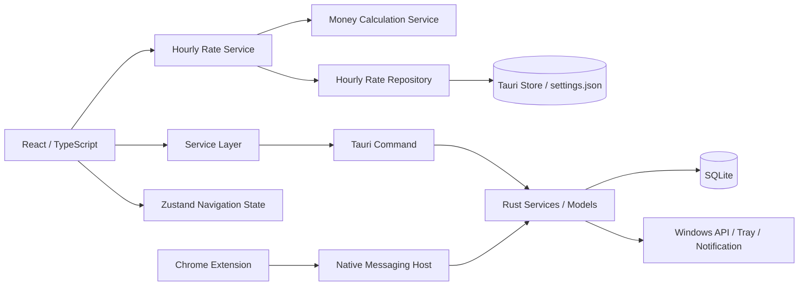

# Time Is Money Project Spec

## 1. アプリ概要

- 仮のアプリ名: Time Is Money
- アプリの目的: PC 作業中に使った時間を金額換算し、浪費の傾向を可視化する。
- 解決したい課題: 何にどれだけ時間を使ったかを感覚ではなく数値で把握しにくいこと。
- 想定ユーザー: Windows PC で仕事や学習をしている個人ユーザー。
- 将来的な完成イメージ: 前面アプリやサイトの利用時間を自動で集計し、金額・カテゴリ・通知・履歴で確認できるデスクトップアプリ。
- 現在実装済みの範囲: 4画面とナビゲーション、アプリ起動からの経過時間表示、自動起動設定、テスト通知、システムトレイ、前面Windowsアプリの継続監視とsession単位の利用時間snapshot、Chrome拡張機能とNative Messaging Hostによるサイト（ドメイン）別利用時間計測、前面ウィンドウ情報の単発取得、デフォルト時給とWindowsアプリ別時給の登録・保存・解決、Tauri Command、型・値検証付きフロントサービス。
- 現在未実装の範囲: 利用時間からの活動レコード作成・SQLite保存・分類・金額結果UI・履歴表示、実際の利用条件に基づく通知、集計、グラフ、idle/lock検出、外部通信。

## 2. 使用技術

### Tauri v2

- 何か: Rust バックエンドと Web フロントエンドを組み合わせるデスクトップアプリ基盤。
- 一般的な用途: 軽量なクロスプラットフォームデスクトップアプリの開発。
- このアプリでの担当: Windows向けデスクトップウィンドウ、Tauri Command、通知・自動起動プラグイン、システムトレイなどOS連携の窓口。
- 採用理由: Electron より軽量な構成を保ちやすく、Rust 側に OS 依存処理を寄せやすい。
- 現時点の導入状況: 導入済み。
- 導入する予定の段階: 基盤として初期段階から利用する。

### React

- 何か: UI をコンポーネント単位で組み立てるライブラリ。
- 一般的な用途: SPA やデスクトップ UI の画面構築。
- このアプリでの担当: タイマー / カレンダー / グラフ / 設定の画面表示。
- 採用理由: 画面分割と将来的な拡張がしやすい。
- 現時点の導入状況: 導入済み。
- 導入する予定の段階: 画面雛形の段階から利用する。

### TypeScript

- 何か: JavaScript に型を追加した言語。
- 一般的な用途: フロントエンドの型安全な開発。
- このアプリでの担当: 画面、型定義、状態管理、Tauri Commandを呼ぶサービス境界の整理。
- 採用理由: 将来のデータ構造や Tauri Command の呼び出しを整理しやすい。
- 現時点の導入状況: 導入済み。
- 導入する予定の段階: 最初から利用する。

### Vite

- 何か: 高速なフロントエンド開発・ビルドツール。
- 一般的な用途: 開発サーバー、HMR、成果物ビルド。
- このアプリでの担当: React フロントエンドの起動とビルド。
- 採用理由: Tauri のフロントエンドと相性がよく、開発体験が軽い。
- 現時点の導入状況: 導入済み。
- 導入する予定の段階: 初期構成から利用する。

### Rust

- 何か: 高性能で安全性を重視したシステムプログラミング言語。
- 一般的な用途: OS 連携、CLI、バックエンド、ネイティブアプリ基盤。
- このアプリでの担当: Tauriバックエンド、Windows APIによる単発取得、通知・トレイ・ウィンドウ制御、将来的なデータ処理。
- 採用理由: Windows API やファイル/SQLite 周りを堅牢に扱いやすい。
- 現時点の導入状況: 導入済み。
- 導入する予定の段階: 最初から利用する。

### SQLite

- 何か: 埋め込み型の軽量データベース。
- 一般的な用途: ローカル保存、設定管理、履歴管理。
- このアプリでの担当: 将来の活動履歴、集計、分類ルールの端末内保存。現在の小規模な時給設定はTauri Storeへ分離する。
- 採用理由: 外部サーバーを使わずにデータを端末内へ保存できる。
- 現時点の導入状況: 未導入。
- 導入する予定の段階: 履歴保存の実装段階。

### Zustand

- 何か: React 向けの軽量状態管理ライブラリ。
- 一般的な用途: UI 状態やローカル状態の管理。
- このアプリでの担当: 画面切り替えと、アプリ起動からの経過時間を表すUI状態。
- 採用理由: 大げさな状態管理を避けつつ、必要な共有状態を持てる。
- 現時点の導入状況: 導入済み。
- 導入する予定の段階: 初期画面から利用する。

### Zod

- 何か: 実行時バリデーションと型推論を両立しやすいスキーマライブラリ。
- 一般的な用途: フォーム入力や設定値の検証。
- このアプリでの担当: Tauri Commandから返る前面ウィンドウ情報、version付き時給設定、process名とappIdの整合性、時給フォーム入力の実行時検証。
- 採用理由: TypeScript 型と実行時検証を近い形で保てる。
- 現時点の導入状況: 導入済み。
- 導入する予定の段階: 雛形の段階からスキーマを準備する。

### Tauri SQL Plugin

- 何か: Tauri から SQL ベースの保存処理を扱うためのプラグイン。
- 一般的な用途: ローカル DB へのアクセス。
- このアプリでの担当: 将来的な SQLite への保存と参照。
- 採用理由: Rust 側で直接 SQL 取り回しを抱えすぎず、Tauri 側の仕組みに寄せられる可能性があるため。
- 現時点の導入状況: 未導入。
- 導入する予定の段階: SQLite 永続化を実装する段階。

### Tauri Store Plugin

- 何か: Tauri でローカルな小規模設定を扱うためのプラグイン。
- 一般的な用途: 軽量な設定保存。
- このアプリでの担当: `settings.json`へversion付きの時給設定を保存し、アプリ再起動後に復元する。時給設定のkeyは`hourly-rate-settings-v1`。
- 採用理由: 小規模な設定を履歴・集計用SQLiteから分離し、Tauri管理のapp data directoryへ明示的に保存できるため。
- 現時点の導入状況: JavaScript/Rustともにv2系を導入済み。`autoSave: false`でloadし、保存時に`save()`をawaitする。
- 権限: `load / get / set / save`と保存失敗時のdisk復元用`reload`だけを許可する。`delete / clear / reset`は許可しない。
- 共有方針: `src/repositories/settingsStore.ts`を低level adapterとして共用し、#51など別設定は同じfile内の別keyを使う。

### Tauri Notification Plugin

- 何か: ネイティブ通知を出すためのプラグイン。
- 一般的な用途: デスクトップ通知。
- このアプリでの担当: Rust側からの起動5秒後の開発用仮通知。将来は実際の利用時間に基づく注意喚起を担当する。
- 採用理由: Windows 標準の通知体験に合わせやすい。
- 現時点の導入状況: Rust側へ導入済み。通知文グループ、ランダム選択、起動5秒後の仮通知まで実装済み。
- 導入する予定の段階: プラグイン導入は完了。利用時間や設定値との接続は後続段階で行う。

### Tauri Autostart Plugin

- 何か: OS 起動時の自動起動を扱うプラグイン。
- 一般的な用途: ログイン後の自動起動。
- このアプリでの担当: Windows 起動時にアプリを立ち上げる設定。
- 採用理由: 常駐系の利用と相性がよい。
- 現時点の導入状況: 導入済み。設定画面から現在状態を確認し、有効・無効を切り替えられる。
- 導入する予定の段階: 基本実装は完了。必要に応じて初期値やエラー表示を調整する。

### Tauri TrayIcon

- 何か: システムトレイにアイコンを出す仕組み。
- 一般的な用途: バックグラウンド常駐アプリの操作口。
- このアプリでの担当: ウィンドウを閉じたときの非表示化、左クリックでの再表示、メニューからの再表示・終了。
- 採用理由: 監視系アプリの操作性を損なわずに常駐しやすい。
- 現時点の導入状況: 導入済み。アプリアイコン、開く・終了メニュー、左クリックによる再表示を実装済み。
- 導入状況: 基本実装と継続監視処理は完了。Rust側のトラッカーはウィンドウの表示状態と独立して動作する。

### Windows API

- 何か: Windows 固有の OS 機能を扱う API 群。
- 一般的な用途: 前面ウィンドウ取得、アイドル判定、自動起動、ウィンドウ管理。
- このアプリでの担当: 前面ウィンドウの実行ファイル名、タイトル、PIDの単発取得。アイドル判定は将来の対象。
- 採用理由: Windows 向けアプリとして必要な情報を直接取得しやすい。
- 現時点の導入状況: 前面ウィンドウ情報の単発取得へ導入済み。
- 導入する予定の段階: 単発取得は実装済み。継続監視やアイドル判定は後続段階で追加する。

### Rust の windows クレート

- 何か: Windows API を Rust から扱うためのクレート。
- 一般的な用途: Win32 API や COM を Rust で呼ぶ。
- このアプリでの担当: 前面ウィンドウ取得、プロセス情報、アイドル判定などの Windows 依存処理。
- 採用理由: Rust の型安全さを保ちながら Windows API を扱いやすい。
- 現時点の導入状況: 必要なWin32 featureに限定したWindowsターゲット依存として導入済み。
- 導入する予定の段階: 前面ウィンドウの単発取得へ導入済み。追加APIは用途が決まった段階で検討する。

### Chrome Native Messaging

- 何か: Chrome拡張機能とローカルのネイティブ実行ファイルをstdin/stdoutで接続する仕組み。
- このアプリでの担当: アクティブなHTTP/HTTPS URLをサニタイズしてNative Messaging Hostへ渡し、localhostブリッジ経由でTauriへ通知する。
- 現時点の導入状況: 開発用拡張機能IDの固定、Host登録、URL変更・計測停止、接続失敗表示、タイマー画面への現在セッション反映まで実装済み。
- プライバシー境界: query、hash、URL内の認証情報を拡張機能とHostの両側で除去する。クラウド送信は行わない。

## 3. アーキテクチャ

- React・TypeScript 側が担当する処理: 画面表示、ナビゲーション、アプリ起動からの経過時間状態、自動起動設定、時給設定の検証・解決・repository、サービス層を通したCommand呼び出しと実行時検証。
- Rust 側が担当する処理: Tauriウィンドウ制御、Windows APIから前面process名だけを取得する常駐worker、利用時間accumulator、Tauri Command、Store Plugin初期化、システムトレイ、起動5秒後の仮通知。
- Tauri Command の呼び出し構造: 単発取得の`getActiveWindowInfo()`に加え、`start_app_usage_tracking`、`get_app_usage_tracking_snapshot`、`stop_app_usage_tracking`を`appUsageTrackingService.ts`がinvokeし、wire/public snapshotをZodで検証する。
- 将来的な SQLite 保存の流れ: UI で設定や分類結果を更新し、Rust 側のサービスが SQLite へ保存する予定。
- 前面ウィンドウ取得の流れ: Rust側のplatformモジュールがWindows APIから情報を取得し、登録済みCommand経由でフロントサービスへ返す。
- 現在のタイマー表示の流れ: `useMeasurementTracking`がZustandの`sessionId / startedAt`をRust trackerへ一度だけ渡し、1秒ごとに総経過時間を同期する。開発時だけTimerPageのdiagnosticsが表示用snapshotを更新し、計測そのものは画面遷移・トレイ非表示と独立して継続する。
- 現在の時給設定の流れ: 設定画面のUIがrepositoryからversion 1設定を読み、Zod検証後の値だけを表示する。保存時は純粋serviceで新しい設定を作り、repositoryが`settings.json`の`hourly-rate-settings-v1`へ書き込む。
- 時給解決と金額計算の流れ: consumerはraw process名を`resolveHourlyRateYen()`へ渡し、返された0以上の有限数を`calculateMoneyBreakdown()`へ渡す。時給serviceは#13の金額式や丸めを持たない。
- 現在の利用時間計測の流れ: Rust workerが1秒samplingで前面process名を観測し、millisecondsで排他的に集計する。5秒超gap、self、null、取得失敗はuntrackedにする。stop時は最初の`endedAt`でfinal snapshotを固定し、後続consumerは同じ境界でretryできる。
- 将来的な活動計測の流れ: 固定snapshotを活動レコードへ変換し、SQLiteへ保存する予定。
- Chromeサイト計測の流れ: 拡張機能が前面タブのHTTP/HTTPS URLからドメインだけを取り出し、成功ACKを受けた値だけを送信済みとして保持する。Native Messaging HostがTauriへ転送し、フロントはZod検証後にドメイン単位のZustandセッションを開始・終了する。URLのpath、query、hash、ページタイトルは保存・表示しない。
- 将来的な分類ルール適用の流れ: `AppRule` に基づいて process/title/domain を分類し、カテゴリを決定する予定。
- 現在の通知処理: Rust側の通知サービスが起動5秒後にスパルタ口調の仮通知をランダム送信する。将来は実際の活動時間と設定値を使う条件へ置き換える。

### 構成図



### アプリ別利用時間の契約

- `sessionId`、`startedAt`、`endedAt`はtimerとtrackerで共有する。内部単位はmilliseconds、公開単位はcompleted secondsである。
- public snapshotは`apps / trackedDurationSeconds / untrackedDurationSeconds / durationSeconds`のみを返し、`tracked + untracked = total`を検証する。
- process名は#52と同じtrim・NFC・lowercaseでcanonical app IDへ統合してから秒へ丸める。case/NFC差は一appへmergeする。
- window title、URL、PID、full pathはwire、state、DOM、error、ログ、保存payloadへ渡さない。raw Windows/Tokio errorも公開しない。
- browserは`chrome.exe`等のdesktop processとして一件だけ計測する。同時にChrome拡張がドメイン別の別表示を作るが、desktop snapshotへ加算しないため二重計上しない。idle/lock判定、結果UI、金額換算、永続化は対象外である。

## 4. ファイル構成

### `src/`

- 何か: React フロントエンドの本体。
- 何のために存在するか: 画面表示、状態管理、将来の設定やデータ取得の分離。
- 将来的にどの処理を担当するか: UI、ユーザー操作、Command 呼び出しの起点。
- 現時点でどこまで実装されているか: 4画面の切り替え、起動経過タイマー、前面Windowsアプリ別の利用時間計測、開発限定diagnostics、自動起動設定、時給設定、開発用仮通知を実装済み。カレンダーとグラフはプレースホルダー。
- どのファイルから呼ばれる予定か: `index.html` から `src/main.tsx` を経由して起動される。
- 今後どのような機能を追加する場所か: グラフ、入力フォーム、履歴、設定 UI。

### `src/components/layout/`

- 何か: 画面共通のレイアウトを置く場所。
- 何のために存在するか: 画面ごとの共通構造を分離するため。
- 将来的にどの処理を担当するか: サイドバー、ヘッダー、レイアウト枠。
- 現時点でどこまで実装されているか: `AppLayout` と `Sidebar` のみ。
- どのファイルから呼ばれる予定か: `src/App.tsx` から呼ばれる。
- 今後どのような機能を追加する場所か: ナビゲーション拡張、常駐操作、レイアウト共通化。

### `src/pages/`

- 何か: 画面単位の React コンポーネントを置く場所。
- 何のために存在するか: タイマー / カレンダー / グラフ / 設定を独立させるため。
- 将来的にどの処理を担当するか: 各画面のデータ表示、入力、状態表示。
- 現時点でどこまで実装されているか: タイマーは起動経過時間、development限定のWindowsアプリ別利用時間diagnostics、Chrome拡張機能の接続状態、現在のサイト、ドメイン別利用時間を表示する。設定は自動起動、デフォルト時給、前面Windowsアプリの登録、アプリ別上書き時給を操作できる。カレンダーとグラフはページ名と説明のみ。
- どのファイルから呼ばれる予定か: `src/App.tsx` から呼ばれる。
- 今後どのような機能を追加する場所か: 集計グラフ、一覧、編集フォーム。

### `src/stores/useNavigationStore.ts`

- 何か: 画面切り替え用の Zustand ストア。
- 何のために存在するか: ナビゲーション状態を分離するため。
- 将来的にどの処理を担当するか: 画面遷移や UI 状態の共有。
- 現時点でどこまで実装されているか: `currentPage` と切り替えのみ。
- どのファイルから呼ばれる予定か: `src/hooks/useNavigation.ts` と `src/App.tsx` から呼ばれる。
<<<<<<< HEAD
<<<<<<< HEAD
- 今後どのような機能を追加する場所か: 選択中の期間、フィルタ、表示モード。

### `src/stores/useActivityStore.ts`

- 何か: アプリ起動からの経過時間を管理するZustandストア。
- 何のために存在するか: `setInterval`の呼び出し回数ではなく、開始時刻との差分から実経過時間を表示するため。
- 将来的にどの処理を担当するか: 現在は起動経過時間のみ。アプリ別活動計測とは分離したまま、必要に応じて表示状態を拡張する。
- 現時点でどこまで実装されているか: 開始時刻の記録、1秒単位の同期、負の経過時間を0へ補正する処理を実装済み。
- どのファイルから呼ばれるか: `src/App.tsx`が開始・同期し、`src/pages/TimerPage.tsx`が表示する。
- 今後どのような機能を追加する場所か: アプリ全体の計測状態表示。前面アプリ別の履歴データは別の監視・保存層で管理する。
=======
- 今後どのような機能を追加する場所か: 選択中の期間、フィルタ、表示モード。

### `src/stores/useActivityStore.ts`

- 何か: アプリ起動からの経過時間を管理するZustandストア。
- 何のために存在するか: `setInterval`の呼び出し回数ではなく、開始時刻との差分から実経過時間を表示するため。
- 将来的にどの処理を担当するか: 総経過時間とtimer session identityを持つ。アプリ別のraw計測値はRust trackerに分離したまま、必要に応じて結果表示へ渡す。
- 現時点でどこまで実装されているか: 開始時刻とsession IDの記録、1秒単位の同期、負の経過時間を0へ補正、最初の停止境界の固定を実装済み。
- どのファイルから呼ばれるか: `useMeasurementTracking`が開始・同期し、`src/pages/TimerPage.tsx`が総経過時間を表示する。
- 今後どのような機能を追加する場所か: アプリ全体の計測状態表示。前面アプリ別の履歴データは別の監視・保存層で管理する。
>>>>>>> be486ac94b78dc944446791174e5157f278448bd

### `src/hooks/useNavigation.ts`

- 何か: Zustand ストアを扱いやすくする小さな hook。
- 何のために存在するか: UI 側からの利用を簡潔にするため。
- 将来的にどの処理を担当するか: 画面切り替え状態の参照と更新。
- 現時点でどこまで実装されているか: 現在ページと切り替え関数を返すだけ。
- どのファイルから呼ばれる予定か: `src/App.tsx` から呼ばれる。
- 今後どのような機能を追加する場所か: フィルタや選択状態をまとめる hook の追加。

### `src/constants/navigation.ts`

- 何か: ナビゲーション項目の定義。
- 何のために存在するか: sidebar と state の型をそろえるため。
- 将来的にどの処理を担当するか: 画面追加時のルーティング/切り替え定義。
- 現時点でどこまで実装されているか: 4 画面分の項目のみ。
- どのファイルから呼ばれる予定か: `Sidebar` と `useNavigationStore` から参照される。
- 今後どのような機能を追加する場所か: 画面追加時の項目増設。

<<<<<<< HEAD
### `src/services/`

- 何か: UI と Tauri Command の間に置くサービス層。
- 何のために存在するか: 画面から直接 Rust 実装を意識しないため。
- 将来的にどの処理を担当するか: Command呼び出し、データ検証・整形、保存ロジック。
- 現時点でどこまで実装されているか: `activityService.ts`時間表示用の `formatTime()` と、前面ウィンドウ情報を1回取得してnullableなZodスキーマで型・値検証する `getActiveWindowInfo()` 、`hourlyRateSettingsService.ts`のprocess名正規化・登録・変更・解除・fallback解決、`moneyCalculationService.ts`の分類別金額換算を実装済み。
- どのファイルから呼ばれる予定か: 境界テストから利用済み。設定画面が前面window取得と時給設定serviceを利用し、結合testが時給resolverの結果を金額計算serviceへ渡す。継続監視hookからの呼び出しは未実装。
- 今後どのような機能を追加する場所か: activity / settings / tauri の処理拡張。

### `src/repositories/`

- 何か: Tauri Store Pluginとapplicationの間に置く永続化境界。
- 何のために存在するか: UIや純粋serviceをplugin API、file名、key、disk復元処理から分離するため。
- 現時点でどこまで実装されているか: `settingsStore.ts`が`settings.json`を一度だけloadし、`hourlyRateSettingsRepository.ts`が`hourly-rate-settings-v1`をZod検証、appId順canonicalize、直列保存、save失敗時reload付きで扱う。
- 共有方針: #51などの小規模設定は`settingsStore.ts`を再利用し、domainごとのversion付きkeyで分離する。

### `src/components/settings/HourlyRateSettingsSection.tsx`

- 何か: 時給設定専用の独立React component。
- 現時点でどこまで実装されているか: default時給の読込・保存、3秒countdown後の前面app取得と候補確認、process名だけの登録、app別overrideの変更・明示0・解除、status/error表示、再起動復元を実装済み。
- privacy境界: `ActiveWindowInfo`から即座に`processName`だけを候補へprojectし、window titleとPIDをcomponent state・DOM・repositoryへ渡さない。
>>>>>>> d6ac130f99af4cc349d0a84b4a274f6bfc7f8f2e
=======
### `src/services/`

- 何か: UI と Tauri Command の間に置くサービス層。
- 何のために存在するか: 画面から直接 Rust 実装を意識しないため。
- 将来的にどの処理を担当するか: Command呼び出し、データ検証・整形、保存ロジック。
- 現時点でどこまで実装されているか: `activityService.ts`の単発前面window取得、`appUsageTrackingService.ts`のstart/preview/stop・Zod検証・canonical app統合、`hourlyRateSettingsService.ts`のprocess名正規化・登録・変更・解除・fallback解決、`moneyCalculationService.ts`の分類別金額換算を実装済み。
- どのファイルから呼ばれるか: 設定画面が前面window取得と時給設定serviceを利用し、`useMeasurementTracking`がapp usage serviceを利用する。結合testが時給resolverの結果を金額計算serviceへ渡す。
- 今後どのような機能を追加する場所か: activity / settings / tauri の処理拡張。

### `src/repositories/`

- 何か: Tauri Store Pluginとapplicationの間に置く永続化境界。
- 何のために存在するか: UIや純粋serviceをplugin API、file名、key、disk復元処理から分離するため。
- 現時点でどこまで実装されているか: `settingsStore.ts`が`settings.json`を一度だけloadし、`hourlyRateSettingsRepository.ts`が`hourly-rate-settings-v1`をZod検証、appId順canonicalize、直列保存、save失敗時reload付きで扱う。
- 共有方針: #51などの小規模設定は`settingsStore.ts`を再利用し、domainごとのversion付きkeyで分離する。

### `src/components/settings/HourlyRateSettingsSection.tsx`

- 何か: 時給設定専用の独立React component。
- 現時点でどこまで実装されているか: default時給の読込・保存、3秒countdown後の前面app取得と候補確認、process名だけの登録、app別overrideの変更・明示0・解除、status/error表示、再起動復元を実装済み。
- privacy境界: `ActiveWindowInfo`から即座に`processName`だけを候補へprojectし、window titleとPIDをcomponent state・DOM・repositoryへ渡さない。
>>>>>>> be486ac94b78dc944446791174e5157f278448bd

### `src/types/`

- 何か: 将来のデータ構造を表す型定義。
- 何のために存在するか: UI と Rust 側の設計を合わせるため。
- 将来的にどの処理を担当するか: 活動記録、設定、前面ウィンドウ情報の型管理。
- 現時点でどこまで実装されているか: 活動・結果系の型に加え、runtime正本の`HourlyRateSettings`と`DesktopAppHourlyRateSetting`を定義している。
- どのファイルから呼ばれる予定か: サービス、ページ、Rust モデル設計の参照元。
- 今後どのような機能を追加する場所か: 履歴、設定、集計の型追加。

### `src/utils/schemas.ts`

<<<<<<< HEAD
- 何か: Zod スキーマを置く場所。
- 何のために存在するか: 型と実行時検証の雛形をそろえるため。
- 将来的にどの処理を担当するか: 設定値や Command 入力の検証。
- 現時点でどこまで実装されているか: 以下のスキーマ検証が実装されている
  - `activeWindowInfoSchema`: プロセス名の空文字とPID範囲外・非整数・0を拒否
  - `hourlyRateSettingsSchemas.ts`: 時給のfinite/nonnegative条件、schema version、process名、appId一致、重複、strictな保存shapeを検証
  - これらはTauri Command戻り値検証に利用されている
- どのファイルから呼ばれる予定か: `activityService.ts` から利用済み。将来的にフォームや保存処理からも呼ばれる。
=======
- 何か: Zod スキーマを置く場所。
- 何のために存在するか: 型と実行時検証の雛形をそろえるため。
- 将来的にどの処理を担当するか: 設定値や Command 入力の検証。
- 現時点でどこまで実装されているか: `activeWindowInfoSchema`に加え、`appUsageTrackingSchemas.ts`がcamelCase wire、schema version、safe integer、合計不変条件、公開snapshotの順序・重複・privacy fieldを検証する。`hourlyRateSettingsSchemas.ts`は時給のfinite/nonnegative条件、schema version、process名、appId一致、重複、strictな保存shapeを検証する。
- どのファイルから呼ばれる予定か: `activityService.ts` から利用済み。将来的にフォームや保存処理からも呼ばれる。
>>>>>>> be486ac94b78dc944446791174e5157f278448bd
- 今後どのような機能を追加する場所か: 入力検証と保存前チェック。

### `src-tauri/`

<<<<<<< HEAD
<<<<<<< HEAD
- 何か: Rust 側の Tauri バックエンド。
- 何のために存在するか: OS 依存処理と将来の Command をまとめるため。
- 将来的にどの処理を担当するか: 前面ウィンドウ取得、保存、通知、常駐、起動処理。
- 現時点でどこまで実装されているか: 前面ウィンドウ取得のplatform処理とTauri Command、通知、自動起動、Store Plugin、システムトレイ、閉じる操作でのウィンドウ非表示化を実装済み。
=======
- 何か: Rust 側の Tauri バックエンド。
- 何のために存在するか: OS 依存処理と将来の Command をまとめるため。
- 将来的にどの処理を担当するか: 前面ウィンドウ取得、保存、通知、常駐、起動処理。
- 現時点でどこまで実装されているか: 前面process名の最小取得と常駐tracker、start/preview/stop Command、通知、自動起動、Store Plugin、システムトレイ、閉じる操作でのウィンドウ非表示化を実装済み。
>>>>>>> be486ac94b78dc944446791174e5157f278448bd
- どのファイルから呼ばれる予定か: Tauri ランタイムから起動される。
- 今後どのような機能を追加する場所か: Command拡張、SQLite、利用条件に基づく通知、idle/lock観測。

### `src-tauri/src/models/`

- 何か: Rust の共有データモデル。
- 何のために存在するか: TS 型と意味を合わせるため。
- 将来的にどの処理を担当するか: Command 戻り値、保存データ、変換処理。
- 現時点でどこまで実装されているか: Activity / Settings系に加え、version付きcamelCaseのAppUsageSnapshot wireとraw process durationを定義している。
- どのファイルから呼ばれる予定か: `commands` と `services` から参照される。
- 今後どのような機能を追加する場所か: 履歴やルールの Rust 側モデル追加。

### `src-tauri/src/commands/`

- 何か: Tauri Command を置く層。
- 何のために存在するか: Rust 側の関数をフロントから呼びやすくするため。
- 将来的にどの処理を担当するか: 設定取得、履歴保存、状態読み出しなど。
- 現時点でどこまで実装されているか: `activity.rs`が単発`get_active_window_info`と、安定error codeだけを返すapp usageのstart/preview/stop Commandを公開する。
- どのファイルから呼ばれる予定か: `lib.rs` のinvoke handlerへ登録済みで、フロントサービスから呼ばれる。
- 今後どのような機能を追加する場所か: Activity / Settings / Tray / Window 系 Command。

### `src-tauri/src/platform/windows.rs`

- 何か: Windows 固有処理の配置場所。
- 何のために存在するか: OS 依存処理を Rust 側で分離するため。
- 将来的にどの処理を担当するか: 前面ウィンドウ取得、アイドル状態、プロセス情報。
- 現時点でどこまで実装されているか: 最小権限で前面ウィンドウの実行ファイル名、タイトル、PIDを単発取得する。前面ウィンドウなしと取得失敗を区別し、process handleをRAIIで解放する。
- どのファイルから呼ばれる予定か: `commands/activity.rs` から呼ばれている。
- 今後どのような機能を追加する場所か: 後続要件で必要になったWindows固有処理。継続監視自体はこの層では行わない。

### `src-tauri/migrations/`

- 何か: SQLite マイグレーション置き場。
- 何のために存在するか: スキーマ変更を履歴として管理するため。
- 将来的にどの処理を担当するか: DB テーブル作成や更新。
- 現時点でどこまで実装されているか: README のみで未実装。
- どのファイルから呼ばれる予定か: SQLite 導入後の起動処理から参照される。
- 今後どのような機能を追加する場所か: テーブル追加、カラム変更、初期データ投入。

<<<<<<< HEAD
<<<<<<< HEAD
## 5. データ設計案

- TypeScript の型: `ActivityRecord`, `AppRule`, `AppSettings`, `ActiveWindowInfo`, `ActivityCategory`, `MoneyCalculationInput`, `MoneyBreakdown`。
- Rust の構造体: `ActivityRecord`, `AppRule`, `AppSettings`, `ActiveWindowInfo`, `ActivityCategory`, `MatchType` を定義済み。
=======
## 5. データ設計案

- TypeScript の型: `ActivityRecord`, `AppRule`, `AppSettings`, `ActiveWindowInfo`, `ActivityCategory`, `MoneyCalculationInput`, `MoneyBreakdown`, `HourlyRateSettings`, `DesktopAppHourlyRateSetting`。
- Rust の構造体: `ActivityRecord`, `AppRule`, `AppSettings`, `ActiveWindowInfo`, `ActivityCategory`, `MatchType` を定義済み。
- 時給設定のruntime正本: `HourlyRateSettings`のversion 1。`defaultHourlyRateYen`と`desktopApps`を持ち、各app entryは`appId / processName / hourlyRateYen`だけを保存する。
- 初回値: keyがない場合は`schemaVersion: 1 / defaultHourlyRateYen: 0 / desktopApps: []`を返す。読み込みだけではStoreへ書き込まない。
- app識別子: `trim(processName).normalize("NFC").toLowerCase()`で作る。表示用process名はtrim・NFC後のcaseを保持し、空文字、control文字、path separatorを拒否する。
- 時給解決順: 登録appの`hourlyRateYen`がnumberならその値を使い、未登録または`null`ならdefaultへfallbackする。`0`は明示的な有効値なのでfallbackしない。
- 保存順序: repositoryがappId順へcanonicalizeし、同じ論理設定から決定的なJSON payloadを作る。
- legacy設定型: TypeScript/Rustの既存`AppSettings.hourlyRate`は将来案として残る下書きcontractであり、現在の時給設定のruntime正本・Store schemaではない。
>>>>>>> d6ac130f99af4cc349d0a84b4a274f6bfc7f8f2e
=======
## 5. データ設計案

- TypeScript の型: `ActivityRecord`, `AppRule`, `AppSettings`, `ActiveWindowInfo`, `ActivityCategory`, `MoneyCalculationInput`, `MoneyBreakdown`, `HourlyRateSettings`, `DesktopAppHourlyRateSetting`。
- Rust の構造体: `ActivityRecord`, `AppRule`, `AppSettings`, `ActiveWindowInfo`, `ActivityCategory`, `MatchType` を定義済み。
- 時給設定のruntime正本: `HourlyRateSettings`のversion 1。`defaultHourlyRateYen`と`desktopApps`を持ち、各app entryは`appId / processName / hourlyRateYen`だけを保存する。
- アプリ利用時間のruntime正本: memory上のversion 1 `AppUsageSnapshot`。`sessionId / startedAt / capturedAt / apps / trackedDurationSeconds / untrackedDurationSeconds / durationSeconds`を持つが、現時点ではStoreやSQLiteへ保存しない。
- 初回値: keyがない場合は`schemaVersion: 1 / defaultHourlyRateYen: 0 / desktopApps: []`を返す。読み込みだけではStoreへ書き込まない。
- app識別子: `trim(processName).normalize("NFC").toLowerCase()`で作る。表示用process名はtrim・NFC後のcaseを保持し、空文字、control文字、path separatorを拒否する。
- 時給解決順: 登録appの`hourlyRateYen`がnumberならその値を使い、未登録または`null`ならdefaultへfallbackする。`0`は明示的な有効値なのでfallbackしない。
- 保存順序: repositoryがappId順へcanonicalizeし、同じ論理設定から決定的なJSON payloadを作る。
- legacy設定型: TypeScript/Rustの既存`AppSettings.hourlyRate`は将来案として残る下書きcontractであり、現在の時給設定のruntime正本・Store schemaではない。
>>>>>>> be486ac94b78dc944446791174e5157f278448bd
- SQLite のテーブル案: `activity_records`, `app_rules`, `app_settings`。
- 各カラムの意味: `process_name` はプロセス名、`window_title` はウィンドウタイトル、`category` は分類、`started_at` / `ended_at` は開始終了時刻、`duration_seconds` は利用秒数、`hourly_rate` は時給。既存案の `calculated_cost` は互換性確認用のレガシー項目とし、新しい金額計算の正本にはしない。
- 主キー: `id` を TEXT の主キーとして扱う案。
- 日時の保存形式: UNIX epoch の整数で保存する案。
<<<<<<< HEAD
<<<<<<< HEAD
- 金額計算の正本: `src/services/moneyCalculationService.ts` の純粋関数を唯一の計算元とし、Rust、UI、repositoryでは再計算しない。
- 金額計算の入力: `durationSeconds` は0以上の安全な整数で単位は秒、`hourlyRateYen` は0以上の有限数で単位は円/時とする。小数の時給も受け付ける。
- 1レコードの換算式: `Math.round(durationSeconds * hourlyRateYen / 3600)` でレコードごとに円整数へ丸め、その後に集計する。
- 分類別の扱い: `productive` は `earnedYen`、`waste` は `wastedYen` に換算額を入れる。`neutral`、`null`、`undefined` はどちらも0円とする。未知の分類値はエラーにする。
- 金額結果の不変条件: `earnedYen` と `wastedYen` は0以上の安全な整数、`netYen` は `earnedYen - wastedYen` とする。集計はレコード別の `MoneyBreakdown` を加算し、この条件を維持する。
- 金額計算の失敗: 不正な秒数・時給・分類・内訳、および JavaScript の安全な整数範囲を超える結果は、値をログやメッセージへ露出させず `MoneyCalculationError` で通知する。
- UI・保存との接続: 金額計算サービスは実装済みだが、画面表示と永続化には未接続。将来の保存処理はサービスが返した `MoneyBreakdown` を扱い、`calculated_cost` や別式から再計算しない。
=======
- 金額計算の正本: `src/services/moneyCalculationService.ts` の純粋関数を唯一の計算元とし、Rust、UI、repositoryでは再計算しない。
- 金額計算の入力: `durationSeconds` は0以上の安全な整数で単位は秒、`hourlyRateYen` は0以上の有限数で単位は円/時とする。小数の時給も受け付ける。
- 1レコードの換算式: `Math.round(durationSeconds * hourlyRateYen / 3600)` でレコードごとに円整数へ丸め、その後に集計する。
- 分類別の扱い: `productive` は `earnedYen`、`waste` は `wastedYen` に換算額を入れる。`neutral`、`null`、`undefined` はどちらも0円とする。未知の分類値はエラーにする。
- 金額結果の不変条件: `earnedYen` と `wastedYen` は0以上の安全な整数、`netYen` は `earnedYen - wastedYen` とする。集計はレコード別の `MoneyBreakdown` を加算し、この条件を維持する。
- 金額計算の失敗: 不正な秒数・時給・分類・内訳、および JavaScript の安全な整数範囲を超える結果は、値をログやメッセージへ露出させず `MoneyCalculationError` で通知する。
- UI・保存との接続: 時給設定UIとStore永続化は実装済み。アプリ別利用時間と金額結果の画面表示・履歴保存は未接続で、後続consumerはresolverの値を金額計算serviceへ渡す。
>>>>>>> d6ac130f99af4cc349d0a84b4a274f6bfc7f8f2e
=======
- 金額計算の正本: `src/services/moneyCalculationService.ts` の純粋関数を唯一の計算元とし、Rust、UI、repositoryでは再計算しない。
- 金額計算の入力: `durationSeconds` は0以上の安全な整数で単位は秒、`hourlyRateYen` は0以上の有限数で単位は円/時とする。小数の時給も受け付ける。
- 1レコードの換算式: `Math.round(durationSeconds * hourlyRateYen / 3600)` でレコードごとに円整数へ丸め、その後に集計する。
- 分類別の扱い: `productive` は `earnedYen`、`waste` は `wastedYen` に換算額を入れる。`neutral`、`null`、`undefined` はどちらも0円とする。未知の分類値はエラーにする。
- 金額結果の不変条件: `earnedYen` と `wastedYen` は0以上の安全な整数、`netYen` は `earnedYen - wastedYen` とする。集計はレコード別の `MoneyBreakdown` を加算し、この条件を維持する。
- 金額計算の失敗: 不正な秒数・時給・分類・内訳、および JavaScript の安全な整数範囲を超える結果は、値をログやメッセージへ露出させず `MoneyCalculationError` で通知する。
- UI・保存との接続: 時給設定UIとStore永続化は実装済み。アプリ別利用時間は開発限定diagnosticsへ表示するが、金額結果UI・履歴保存は未接続で、後続consumerはsnapshotとresolverの値を金額計算serviceへ渡す。
>>>>>>> be486ac94b78dc944446791174e5157f278448bd
- カテゴリの管理方法: `productive / waste / neutral` の列挙型で管理する案。
- データベースが未実装であること: 活動履歴用SQLiteは未実装。小規模設定の永続化にはTauri Store Pluginを使用しており、役割を混同しない。

## 6. 開発コマンド

- `npm install`: 依存関係をインストールする。
- `npm run dev`: Vite の開発サーバーを起動する。ブラウザ確認用。
- `npm run tauri dev`: Tauri のデスクトップウィンドウを開く。Rust のコンパイルも発生する。
- `npm run build`: フロントエンドを型チェック付きでビルドする。ブラウザ配布物の生成用。
- `npm run tauri build`: Tauri の配布用ビルドを行う。デスクトップ配布物を生成する。
- `npm run lint`: ESLint でフロントエンドのコードを確認する。
- `npm run typecheck`: TypeScript の型チェックのみを行う。

## 7. 開発環境構築

Windows で必要なもの:

- Node.js 24（LTS）
- npm
- Rust
- Cargo
- Microsoft C++ Build Tools
- WebView2
- Git

確認コマンド:

```bash
node -v
npm -v
rustc --version
cargo --version
git --version
```

`node -v`は`v24.x`で始まること。

## 8. 起動方法

```bash
git clone <repository-url>
cd <project-directory>
npm install
npm run tauri dev
```

<<<<<<< HEAD
<<<<<<< HEAD
## 9. 実装状況


- 現在の主要構成: React画面、Zustandストア、Zodスキーマ、TypeScriptサービス、Rustモデル・platform・Command、Tauri通知・自動起動・システムトレイ設定。
- 現在動作する機能: 4画面の切り替え、アプリ起動からの経過時間表示、自動起動の切り替え、テスト通知、起動1分後の仮通知、トレイ常駐と再表示・終了、前面ウィンドウ情報の単発取得とTauri Command・型/値検証付きフロントサービス、分類済みレコードの金額換算と集計を行うTypeScript純粋関数。
- プレースホルダーとして存在するファイル: `src/services/settingsService.ts`, `src/services/tauriService.ts`, `src-tauri/src/commands/settings.rs`, `src-tauri/src/services/*`。
- 未実装の機能: 前面ウィンドウの継続監視、切り替え検知、アプリ別時間計測、保存、分類、履歴表示、金額結果のUI表示・保存への接続、ブラウザ拡張機能、クラウド通信。
- 将来実装する機能: 活動レコード作成、ルール適用、SQLite保存、実際の利用条件に基づく通知、日次・週次・月次集計。
- Windows 限定の処理: 前面ウィンドウの単発取得。アイドル検知などは将来の対象。
- 現時点で導入していないライブラリやプラグイン: Tauri SQL Plugin、Tauri Store Plugin。

## 10. セキュリティとプライバシー

- 単発取得できる情報: 前面ウィンドウのプロセス名、ウィンドウタイトル、PID。アプリ別利用時間や分類結果の収集・保存は未実装。自動起動の状態はOSの設定として確認・変更するが、アプリ独自の設定DBはまだない。
- 収集しない予定の情報: 外部アカウント情報、外部サーバー上の閲覧データ、クラウド認証情報。
- データは端末内に保存する方針: 基本的にローカル保存を前提とする。
- 外部サーバーへ送信しない方針: 現時点では送信処理を実装していない。
- ウィンドウタイトルに個人情報が含まれる可能性: あるため、表示・保存・ログの扱いに注意する。
- ログの取り扱い: 前面ウィンドウのタイトルや実行ファイルのフルパスを出力せず、エラーには処理名とOSエラーコードだけを含める。
- Tauri の Capability 設定: 必要最小限の権限のみを与える前提で設計する。
- 必要以上の権限を与えない方針: Command やプラグインを追加する際も都度見直す。
- 現時点で監視や収集を行っていないこと: 単発取得の境界は実装済みだが、アプリ起動時の自動呼び出し、継続監視、保存は未実装。
=======
## 9. 実装状況

- 現在の主要構成: React画面、Zustandストア、Zodスキーマ、TypeScriptサービス・repository、Tauri Store Plugin、Rustモデル・platform・Command、Tauri通知・自動起動・システムトレイ設定。
- 現在動作する機能: 4画面の切り替え、アプリ起動からの経過時間表示、自動起動の切り替え、テスト通知、起動1分後の仮通知、トレイ常駐と再表示・終了、前面ウィンドウ情報の単発取得、デフォルト時給とWindowsアプリ別時給の登録・保存・変更・解除・再起動復元、分類済みレコードの金額換算と集計を行うTypeScript純粋関数。
- プレースホルダーとして存在するファイル: `src/services/settingsService.ts`, `src/services/tauriService.ts`, `src-tauri/src/commands/settings.rs`, `src-tauri/src/services/*`。
- 未実装の機能: 前面ウィンドウの継続監視、切り替え検知、アプリ別時間計測、活動履歴のSQLite保存、分類、履歴表示、金額結果のUI表示・保存への接続、ブラウザ拡張機能、クラウド通信。
- 将来実装する機能: 活動レコード作成、ルール適用、SQLite保存、実際の利用条件に基づく通知、日次・週次・月次集計。
- Windows 限定の処理: 前面ウィンドウの単発取得。アイドル検知などは将来の対象。
- 現時点で導入していないライブラリやプラグイン: Tauri SQL Plugin。

## 10. セキュリティとプライバシー

- 単発取得できる情報: 前面ウィンドウのプロセス名、ウィンドウタイトル、PID。時給設定への登録では直ちにprocess名だけへ絞り、window titleとPIDは保存しない。アプリ別利用時間や分類結果の継続収集・保存は未実装。
- 収集しない予定の情報: 外部アカウント情報、外部サーバー上の閲覧データ、クラウド認証情報。
- データは端末内に保存する方針: 基本的にローカル保存を前提とする。
- 外部サーバーへ送信しない方針: 現時点では送信処理を実装していない。
- ウィンドウタイトルに個人情報が含まれる可能性: あるため、表示・保存・ログの扱いに注意する。
- 時給設定の保存payload: `schemaVersion / defaultHourlyRateYen / desktopApps`と、各appの`appId / processName / hourlyRateYen`だけを許可する。window title、PID、full path、URLはschemaにも保存値にも含めない。
- ログとerrorの取り扱い: 前面ウィンドウのタイトル、process名、実行ファイルのフルパス、raw Store payloadをrepository errorへ含めない。UIには固定の安全なメッセージを出す。
- Tauri のCapability設定: Storeは`load / get / set / reload / save`だけを許可し、`delete / clear / reset`は許可しない。`reload`はsave失敗後のdisk復元専用。
- 壊れた保存値: unknown schema version、field欠落、不正rate、appId重複・不一致をapplicationへ渡さず、自動初期化・上書きもしない。
- 現時点で監視や収集を行っていないこと: 単発取得と利用者操作によるprocess名登録は実装済みだが、アプリ起動時の自動呼び出しや継続監視は未実装。
>>>>>>> d6ac130f99af4cc349d0a84b4a274f6bfc7f8f2e
=======
## 9. 実装状況

- 現在の主要構成: React画面、Zustandストア、Zodスキーマ、TypeScriptサービス・repository、Chrome拡張機能、Native Messaging Host、Tauri Store Plugin、Rustモデル・platform・Command、Tauri通知・自動起動・システムトレイ設定。
- 現在動作する機能: 4画面の切り替え、アプリ起動からの経過時間表示、前面Windowsアプリ別の利用時間snapshot、Chromeのドメイン別利用時間表示、自動起動の切り替え、テスト通知、トレイ常駐と再表示・終了、前面ウィンドウ情報の単発取得、デフォルト時給とWindowsアプリ別時給の登録・保存・変更・解除・再起動復元、分類済みレコードの金額換算と集計を行うTypeScript純粋関数。
- プレースホルダーとして存在するファイル: `src/services/settingsService.ts`, `src/services/tauriService.ts`, `src-tauri/src/commands/settings.rs`。
- 未実装の機能: snapshotからの活動レコード作成・SQLite保存、分類、履歴表示、金額結果のUI表示・保存への接続、idle/lock検出、クラウド通信。
- 将来実装する機能: 活動レコード作成、ルール適用、SQLite保存、実際の利用条件に基づく通知、日次・週次・月次集計。
- Windows 限定の処理: 前面windowのprocess名取得と継続監視。アイドル検知などは将来の対象。
- 現時点で導入していないライブラリやプラグイン: Tauri SQL Plugin。

## 10. セキュリティとプライバシー

- 単発取得できる情報: 前面ウィンドウのプロセス名、ウィンドウタイトル、PID。時給設定への登録では直ちにprocess名だけへ絞り、window titleとPIDは保存しない。継続trackerはprocess名だけを使い、アプリ別利用時間snapshotをmemory上で保持する。
- 収集しない予定の情報: 外部アカウント情報、外部サーバー上の閲覧データ、クラウド認証情報。
- データは端末内に保存する方針: 基本的にローカル保存を前提とする。
- 外部サーバーへ送信しない方針: 現時点では送信処理を実装していない。
- ウィンドウタイトルに個人情報が含まれる可能性: あるため、表示・保存・ログの扱いに注意する。
- 時給設定の保存payload: `schemaVersion / defaultHourlyRateYen / desktopApps`と、各appの`appId / processName / hourlyRateYen`だけを許可する。window title、PID、full path、URLはschemaにも保存値にも含めない。
- ログとerrorの取り扱い: app usageのsnapshot、error、diagnostics、URL受信Command戻り値へ、前面ウィンドウのタイトル、URL、PID、実行ファイルのフルパス、raw Windows/Tokio errorを含めない。repository errorもraw Store payloadを含めず、UIには固定の安全なメッセージを出す。
- Tauri のCapability設定: Storeは`load / get / set / reload / save`だけを許可し、`delete / clear / reset`は許可しない。`reload`はsave失敗後のdisk復元専用。
- 壊れた保存値: unknown schema version、field欠落、不正rate、appId重複・不一致をapplicationへ渡さず、自動初期化・上書きもしない。
- 継続計測の制限: app開始時からの1秒samplingであり、切替瞬間の完全一致は保証しない。5秒超gap、self、null、取得失敗はuntrackedとする。browser URL、idle、lock/unlock、永続化、外部送信は実装していない。
>>>>>>> be486ac94b78dc944446791174e5157f278448bd
