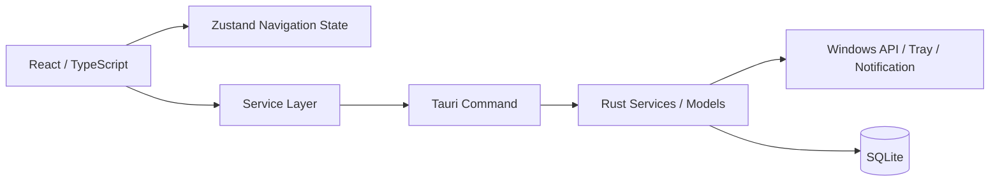

# Time Is Money Project Spec

## 1. アプリ概要

- 仮のアプリ名: Time Is Money
- アプリの目的: PC 作業中に使った時間を金額換算し、浪費の傾向を可視化する。
- 解決したい課題: 何にどれだけ時間を使ったかを感覚ではなく数値で把握しにくいこと。
- 想定ユーザー: Windows PC で仕事や学習をしている個人ユーザー。
- 将来的な完成イメージ: 前面アプリやサイトの利用時間を自動で集計し、金額・カテゴリ・通知・履歴で確認できるデスクトップアプリ。
- 今回作成する範囲: 初期雛形、最低限の画面、型、空のサービス、Rust モジュール構成、設定、仕様書。
- 今回作成しない範囲: 前面ウィンドウ取得、利用時間の自動計測、SQLite の実データ保存、通知、自動起動、システムトレイ、外部通信、集計、グラフ、ブラウザ拡張機能。

## 2. 使用技術

### Tauri v2

- 何か: Rust バックエンドと Web フロントエンドを組み合わせるデスクトップアプリ基盤。
- 一般的な用途: 軽量なクロスプラットフォームデスクトップアプリの開発。
- このアプリでの担当: Windows 向けデスクトップウィンドウの起動、将来的な Command 呼び出し、OS 連携の窓口。
- 採用理由: Electron より軽量な構成を保ちやすく、Rust 側に OS 依存処理を寄せやすい。
- 現時点の導入状況: 導入済み。
- 導入する予定の段階: 基盤として初期段階から利用する。

### React

- 何か: UI をコンポーネント単位で組み立てるライブラリ。
- 一般的な用途: SPA やデスクトップ UI の画面構築。
- このアプリでの担当: Dashboard / History / Rules / Settings の画面表示。
- 採用理由: 画面分割と将来的な拡張がしやすい。
- 現時点の導入状況: 導入済み。
- 導入する予定の段階: 画面雛形の段階から利用する。

### TypeScript

- 何か: JavaScript に型を追加した言語。
- 一般的な用途: フロントエンドの型安全な開発。
- このアプリでの担当: 画面、型定義、サービスのインターフェース整理。
- 採用理由: 将来のデータ構造や Tauri Command の呼び出しを整理しやすい。
- 現時点の導入状況: 導入済み。
- 導入する予定の段階: 最初から利用する。

### Vite

- 何か: 高速なフロントエンド開発・ビルドツール。
- 一般的な用途: 開発サーバー、HMR、成果物ビルド。
- このアプリでの担当: React フロントエンドの起動とビルド。
- 採用理由: Tauri のフロントエンドと相性がよく、開発体験が軽い。
- 現時点の導入状況: 導入済み。
- 導入する予定の段階: 初期構成から利用する。

### Rust

- 何か: 高性能で安全性を重視したシステムプログラミング言語。
- 一般的な用途: OS 連携、CLI、バックエンド、ネイティブアプリ基盤。
- このアプリでの担当: Tauri バックエンド、OS 依存処理の配置、将来的なデータ処理。
- 採用理由: Windows API やファイル/SQLite 周りを堅牢に扱いやすい。
- 現時点の導入状況: 導入済み。
- 導入する予定の段階: 最初から利用する。

### SQLite

- 何か: 埋め込み型の軽量データベース。
- 一般的な用途: ローカル保存、設定管理、履歴管理。
- このアプリでの担当: 活動履歴、ルール、設定の端末内保存。
- 採用理由: 外部サーバーを使わずにデータを端末内へ保存できる。
- 現時点の導入状況: 未導入。
- 導入する予定の段階: 履歴保存の実装段階。

### Zustand

- 何か: React 向けの軽量状態管理ライブラリ。
- 一般的な用途: UI 状態やローカル状態の管理。
- このアプリでの担当: 画面切り替えや将来的な UI 状態。
- 採用理由: 大げさな状態管理を避けつつ、必要な共有状態を持てる。
- 現時点の導入状況: 導入済み。
- 導入する予定の段階: 初期画面から利用する。

### Zod

- 何か: 実行時バリデーションと型推論を両立しやすいスキーマライブラリ。
- 一般的な用途: フォーム入力や設定値の検証。
- このアプリでの担当: 将来的な設定値、Command 入力、保存データの検証。
- 採用理由: TypeScript 型と実行時検証を近い形で保てる。
- 現時点の導入状況: 導入済み。
- 導入する予定の段階: 雛形の段階からスキーマを準備する。

### Tauri SQL Plugin

- 何か: Tauri から SQL ベースの保存処理を扱うためのプラグイン。
- 一般的な用途: ローカル DB へのアクセス。
- このアプリでの担当: 将来的な SQLite への保存と参照。
- 採用理由: Rust 側で直接 SQL 取り回しを抱えすぎず、Tauri 側の仕組みに寄せられる可能性があるため。
- 現時点の導入状況: 未導入。
- 導入する予定の段階: SQLite 永続化を実装する段階。

### Tauri Store Plugin

- 何か: Tauri でローカルな小規模設定を扱うためのプラグイン。
- 一般的な用途: 軽量な設定保存。
- このアプリでの担当: 将来的なアプリ設定の補助的保存。
- 採用理由: すべてを SQLite に寄せる前の選択肢として検討できる。
- 現時点の導入状況: 未導入。
- 導入する予定の段階: 保存方式を確定した後に判断する。

### Tauri Notification Plugin

- 何か: ネイティブ通知を出すためのプラグイン。
- 一般的な用途: デスクトップ通知。
- このアプリでの担当: 長時間利用時の注意喚起。
- 採用理由: Windows 標準の通知体験に合わせやすい。
- 現時点の導入状況: 未導入。
- 導入する予定の段階: 通知機能の実装段階。

### Tauri Autostart Plugin

- 何か: OS 起動時の自動起動を扱うプラグイン。
- 一般的な用途: ログイン後の自動起動。
- このアプリでの担当: Windows 起動時にアプリを立ち上げる設定。
- 採用理由: 常駐系の利用と相性がよい。
- 現時点の導入状況: 未導入。
- 導入する予定の段階: 常駐動作を実装する段階。

### Tauri TrayIcon

- 何か: システムトレイにアイコンを出す仕組み。
- 一般的な用途: バックグラウンド常駐アプリの操作口。
- このアプリでの担当: 将来的な常駐、ウィンドウ表示/非表示切り替え。
- 採用理由: 監視系アプリの操作性を損なわずに常駐しやすい。
- 現時点の導入状況: 未導入。
- 導入する予定の段階: 常駐 UI を実装する段階。

### Windows API

- 何か: Windows 固有の OS 機能を扱う API 群。
- 一般的な用途: 前面ウィンドウ取得、アイドル判定、自動起動、ウィンドウ管理。
- このアプリでの担当: 前面アプリ判定やアイドル判定の実装候補。
- 採用理由: Windows 向けアプリとして必要な情報を直接取得しやすい。
- 現時点の導入状況: 未導入。
- 導入する予定の段階: OS 連携処理の実装段階。

### Rust の windows クレート

- 何か: Windows API を Rust から扱うためのクレート。
- 一般的な用途: Win32 API や COM を Rust で呼ぶ。
- このアプリでの担当: 前面ウィンドウ取得、プロセス情報、アイドル判定などの Windows 依存処理。
- 採用理由: Rust の型安全さを保ちながら Windows API を扱いやすい。
- 現時点の導入状況: 未導入。
- 導入する予定の段階: Windows 固有処理の実装段階。

## 3. アーキテクチャ

- React・TypeScript 側が担当する予定の処理: 画面表示、ナビゲーション、設定入力、将来的な Command 呼び出し、UI 状態管理。
- Rust 側が担当する予定の処理: Tauri ウィンドウ制御、将来的な Windows API 呼び出し、保存処理の仲介、通知、常駐まわり。
- 将来的な Tauri Command の呼び出し構造: React からサービス層を経由し、`@tauri-apps/api` 経由で Rust の Command を呼ぶ予定。
- 将来的な SQLite 保存の流れ: UI で設定や分類結果を更新し、Rust 側のサービスが SQLite へ保存する予定。
- 将来的な前面ウィンドウ取得の流れ: Rust 側の platform モジュールが Windows API から情報を取得し、Command 経由でフロントへ返す予定。
- 将来的なタイマー計測の流れ: Rust 側で監視・区切りを管理し、活動レコードとして保存する予定。
- 将来的な分類ルール適用の流れ: `AppRule` に基づいて process/title/domain を分類し、カテゴリを決定する予定。
- 将来的な通知処理の流れ: 一定時間超過時に Rust 側から通知 API を呼び出す予定。

### 構成図



## 4. ファイル構成

### `src/`

- 何か: React フロントエンドの本体。
- 何のために存在するか: 画面表示、状態管理、将来の設定やデータ取得の分離。
- 将来的にどの処理を担当するか: UI、ユーザー操作、Command 呼び出しの起点。
- 現時点でどこまで実装されているか: 最低限の画面切り替えとプレースホルダー表示。
- どのファイルから呼ばれる予定か: `index.html` から `src/main.tsx` を経由して起動される。
- 今後どのような機能を追加する場所か: グラフ、入力フォーム、履歴、設定 UI。

### `src/components/layout/`

- 何か: 画面共通のレイアウトを置く場所。
- 何のために存在するか: 画面ごとの共通構造を分離するため。
- 将来的にどの処理を担当するか: サイドバー、ヘッダー、レイアウト枠。
- 現時点でどこまで実装されているか: `AppLayout` と `Sidebar` のみ。
- どのファイルから呼ばれる予定か: `src/App.tsx` から呼ばれる。
- 今後どのような機能を追加する場所か: ナビゲーション拡張、常駐操作、レイアウト共通化。

### `src/pages/`

- 何か: 画面単位の React コンポーネントを置く場所。
- 何のために存在するか: Dashboard / History / Rules / Settings を独立させるため。
- 将来的にどの処理を担当するか: 各画面のデータ表示、入力、状態表示。
- 現時点でどこまで実装されているか: ページ名と短い説明のみ。
- どのファイルから呼ばれる予定か: `src/App.tsx` から呼ばれる。
- 今後どのような機能を追加する場所か: 集計グラフ、一覧、編集フォーム。

### `src/stores/useNavigationStore.ts`

- 何か: 画面切り替え用の Zustand ストア。
- 何のために存在するか: ナビゲーション状態を分離するため。
- 将来的にどの処理を担当するか: 画面遷移や UI 状態の共有。
- 現時点でどこまで実装されているか: `currentPage` と切り替えのみ。
- どのファイルから呼ばれる予定か: `src/hooks/useNavigation.ts` と `src/App.tsx` から呼ばれる。
- 今後どのような機能を追加する場所か: 選択中の期間、フィルタ、表示モード。

### `src/hooks/useNavigation.ts`

- 何か: Zustand ストアを扱いやすくする小さな hook。
- 何のために存在するか: UI 側からの利用を簡潔にするため。
- 将来的にどの処理を担当するか: 画面切り替え状態の参照と更新。
- 現時点でどこまで実装されているか: 現在ページと切り替え関数を返すだけ。
- どのファイルから呼ばれる予定か: `src/App.tsx` から呼ばれる。
- 今後どのような機能を追加する場所か: フィルタや選択状態をまとめる hook の追加。

### `src/constants/navigation.ts`

- 何か: ナビゲーション項目の定義。
- 何のために存在するか: sidebar と state の型をそろえるため。
- 将来的にどの処理を担当するか: 画面追加時のルーティング/切り替え定義。
- 現時点でどこまで実装されているか: 4 画面分の項目のみ。
- どのファイルから呼ばれる予定か: `Sidebar` と `useNavigationStore` から参照される。
- 今後どのような機能を追加する場所か: 画面追加時の項目増設。

### `src/services/`

- 何か: UI と Tauri Command の間に置く予定のサービス層。
- 何のために存在するか: 画面から直接 Rust 実装を意識しないため。
- 将来的にどの処理を担当するか: Command 呼び出し、データ整形、保存ロジック。
- 現時点でどこまで実装されているか: コメント付きのプレースホルダーのみ。
- どのファイルから呼ばれる予定か: 将来的に各ページや hook から呼ばれる。
- 今後どのような機能を追加する場所か: activity / settings / tauri の処理拡張。

### `src/types/`

- 何か: 将来のデータ構造を表す型定義。
- 何のために存在するか: UI と Rust 側の設計を合わせるため。
- 将来的にどの処理を担当するか: 活動記録、設定、前面ウィンドウ情報の型管理。
- 現時点でどこまで実装されているか: 主要な型だけを先に定義している。
- どのファイルから呼ばれる予定か: サービス、ページ、Rust モデル設計の参照元。
- 今後どのような機能を追加する場所か: 履歴、設定、集計の型追加。

### `src/utils/schemas.ts`

- 何か: Zod スキーマを置く場所。
- 何のために存在するか: 型と実行時検証の雛形をそろえるため。
- 将来的にどの処理を担当するか: 設定値や Command 入力の検証。
- 現時点でどこまで実装されているか: 型に対応するスキーマ定義のみ。
- どのファイルから呼ばれる予定か: 将来的にフォームや保存処理から呼ばれる。
- 今後どのような機能を追加する場所か: 入力検証と保存前チェック。

### `src-tauri/`

- 何か: Rust 側の Tauri バックエンド。
- 何のために存在するか: OS 依存処理と将来の Command をまとめるため。
- 将来的にどの処理を担当するか: 前面ウィンドウ取得、保存、通知、常駐、起動処理。
- 現時点でどこまで実装されているか: アプリ起動の最小構成と空モジュール。
- どのファイルから呼ばれる予定か: Tauri ランタイムから起動される。
- 今後どのような機能を追加する場所か: Command 実装、SQLite、Windows API、トレイ操作。

### `src-tauri/src/models/`

- 何か: Rust の共有データモデル。
- 何のために存在するか: TS 型と意味を合わせるため。
- 将来的にどの処理を担当するか: Command 戻り値、保存データ、変換処理。
- 現時点でどこまで実装されているか: Activity / Settings 系の構造体のみ。
- どのファイルから呼ばれる予定か: `commands` と `services` から参照される。
- 今後どのような機能を追加する場所か: 履歴やルールの Rust 側モデル追加。

### `src-tauri/src/commands/`

- 何か: Tauri Command を置く予定の層。
- 何のために存在するか: Rust 側の関数をフロントから呼びやすくするため。
- 将来的にどの処理を担当するか: 設定取得、履歴保存、状態読み出しなど。
- 現時点でどこまで実装されているか: モジュールの枠だけ。
- どのファイルから呼ばれる予定か: 将来的に `lib.rs` で登録される。
- 今後どのような機能を追加する場所か: Activity / Settings / Tray / Window 系 Command。

### `src-tauri/src/platform/windows.rs`

- 何か: Windows 固有処理の配置場所。
- 何のために存在するか: OS 依存処理を Rust 側で分離するため。
- 将来的にどの処理を担当するか: 前面ウィンドウ取得、アイドル状態、プロセス情報。
- 現時点でどこまで実装されているか: コメントのみ。
- どのファイルから呼ばれる予定か: `services` や `commands` から呼ばれる予定。
- 今後どのような機能を追加する場所か: `windows` クレートを使う実装。

### `src-tauri/migrations/`

- 何か: SQLite マイグレーション置き場。
- 何のために存在するか: スキーマ変更を履歴として管理するため。
- 将来的にどの処理を担当するか: DB テーブル作成や更新。
- 現時点でどこまで実装されているか: README のみで未実装。
- どのファイルから呼ばれる予定か: SQLite 導入後の起動処理から参照される。
- 今後どのような機能を追加する場所か: テーブル追加、カラム変更、初期データ投入。

## 5. データ設計案

- TypeScript の型: `ActivityRecord`, `AppRule`, `AppSettings`, `ActiveWindowInfo`, `ActivityCategory`。
- 将来的な Rust の構造体: `ActivityRecord`, `AppRule`, `AppSettings`, `ActiveWindowInfo`, `ActivityCategory`, `MatchType`。
- SQLite のテーブル案: `activity_records`, `app_rules`, `app_settings`。
- 各カラムの意味: `process_name` はプロセス名、`window_title` はウィンドウタイトル、`category` は分類、`started_at` / `ended_at` は開始終了時刻、`duration_seconds` は利用秒数、`hourly_rate` は時給、`calculated_cost` は換算金額。
- 主キー: `id` を TEXT の主キーとして扱う案。
- 日時の保存形式: UNIX epoch の整数で保存する案。
- 金額の計算方法: `duration_seconds / 3600 * hourly_rate` を基本とし、表示時に丸める案。
- カテゴリの管理方法: `productive / waste / neutral` の列挙型で管理する案。
- データベースが未実装であること: 現時点では SQLite も永続化も未実装。

## 6. 開発コマンド

- `npm install`: 依存関係をインストールする。
- `npm run dev`: Vite の開発サーバーを起動する。ブラウザ確認用。
- `npm run tauri dev`: Tauri のデスクトップウィンドウを開く。Rust のコンパイルも発生する。
- `npm run build`: フロントエンドを型チェック付きでビルドする。ブラウザ配布物の生成用。
- `npm run tauri build`: Tauri の配布用ビルドを行う。デスクトップ配布物を生成する。
- `npm run lint`: ESLint でフロントエンドのコードを確認する。
- `npm run typecheck`: TypeScript の型チェックのみを行う。

## 7. 開発環境構築

Windows で必要なもの:

- Node.js 24（LTS）
- npm
- Rust
- Cargo
- Microsoft C++ Build Tools
- WebView2
- Git

確認コマンド:

```bash
node -v
npm -v
rustc --version
cargo --version
git --version
```

`node -v`は`v24.x`で始まること。

## 8. 起動方法

```bash
git clone <repository-url>
cd <project-directory>
npm install
npm run tauri dev
```

## 9. 実装状況

- 今回作成したファイル: README、仕様書、Vite/TypeScript 設定、React 画面、Zustand ストア、Zod スキーマ、Rust の初期モジュール、Tauri 設定。
- 現在動作する最低限の機能: 4 画面の切り替えと、初期雛形のウィンドウ起動。
- プレースホルダーとして存在するファイル: `src/services/*`, `src-tauri/src/commands/*`, `src-tauri/src/services/*`, `src-tauri/src/platform/windows.rs`。
- 未実装の機能: 監視、保存、通知、自動起動、トレイ、集計、ブラウザ拡張機能、クラウド通信。
- 将来実装する機能: 活動履歴取得、ルール適用、SQLite 保存、通知、常駐、月次集計。
- Windows 限定になる予定の処理: 前面ウィンドウ取得、アイドル検知、自動起動、システムトレイの一部。
- 今回導入していないライブラリやプラグイン: Tauri SQL Plugin、Tauri Store Plugin、Tauri Notification Plugin、Tauri Autostart Plugin、TrayIcon、windows クレート。

## 10. セキュリティとプライバシー

- 将来的に収集する可能性がある情報: プロセス名、ウィンドウタイトル、利用時間、分類結果、設定値。
- 収集しない予定の情報: 外部アカウント情報、外部サーバー上の閲覧データ、クラウド認証情報。
- データは端末内に保存する方針: 基本的にローカル保存を前提とする。
- 外部サーバーへ送信しない方針: 現時点では送信処理を実装していない。
- ウィンドウタイトルに個人情報が含まれる可能性: あるため、表示・保存・ログの扱いに注意する。
- ログの取り扱い: 必要最小限に留め、個人情報に触れる内容は残さない方針を想定する。
- Tauri の Capability 設定: 必要最小限の権限のみを与える前提で設計する。
- 必要以上の権限を与えない方針: Command やプラグインを追加する際も都度見直す。
- 現時点で監視や収集を行っていないこと: この初期雛形では監視・収集・保存は未実装。
